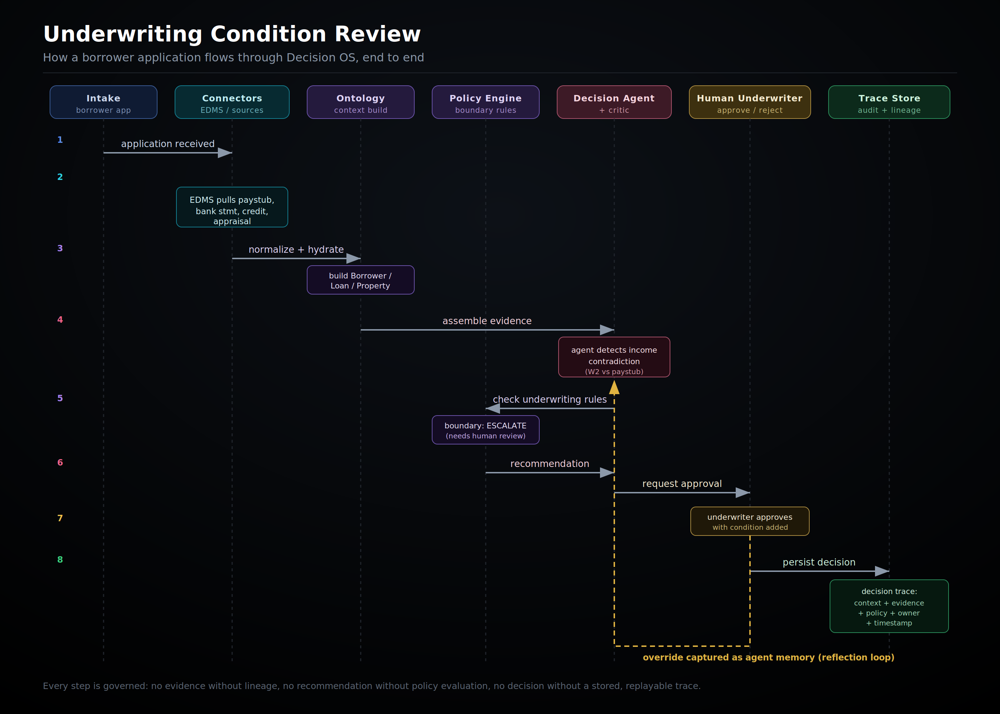

# Decision OS

**A governed, explainable, human-in-the-loop decision platform.**
A domain-agnostic decision engine with pluggable domain packs for each vertical.

Decision OS treats a decision as a first-class, auditable object: every decision has an
owner, every action is checked against policy, every piece of context carries lineage, and
every execution leaves a trace. It is inspired by the design principles of enterprise
ontology and operational-decisioning platforms, reimagined as an open, modular stack.

---

## Why Decision OS

Most "AI decisioning" stops at a model score. Decision OS is built around the parts that
actually make a decision safe to operate in production:

- **Ontology, not tables** — typed business objects with semantic links, so decisions reason over a shared model of the domain.
- **Governed actions** — a boundary engine that decides whether to automate, recommend, escalate, or block.
- **Lineage everywhere** — every context value is traceable to its source.
- **Human-in-the-loop by design** — overrides are captured as evidence and fed back as agent memory.
- **Operational, not analytical** — the output is a workflow action, not a dashboard.

---

## Architecture


> Data flows top-to-bottom through the pipeline; governance and lineage cross-cut every
> layer; human overrides are captured in the workbench and fed back to the decision agents
> as memory.

*An editable, text-based (Mermaid) version of this diagram lives in [`docs/architecture.md`](docs/architecture.md).*

### Layer responsibilities

| Layer | Responsibility |
|-------|----------------|
| **Connector & Ingestion** | Pull from CDC, XML, and API sources; normalize into typed events; hydrate context datasets that hold each entity's latest state via snapshotting. |
| **Ontology** | Typed business objects (the domain model) and system objects (decisions, traces) connected by semantic links. |
| **Decision Engine** | A boundary engine that applies policy to choose automate / recommend / escalate / block; a DAG executor that fires dependent workflows as data changes; decision agents with independent critics and a reflection loop. |
| **Persona Workbench** | Per-persona queues where humans review decisions, inspect supporting data as evidence, and override; snapshots surface bottlenecks. |
| **Governance & Observability** | Lineage and audit trace on every value, DataOps quality monitoring across pipelines, and a registry of policies and hard rules. |

---

## Example: Underwriting Condition Review

Architecture explains *how the platform is organized*. This example shows *how it
operates* — what actually happens when a real borrower application enters Decision OS.



### The flow

1. **Application received** — a borrower's loan application enters intake.
2. **Evidence pulled** — connectors retrieve paystub, bank statements, credit, and appraisal from EDMS.
3. **Context built** — sources are normalized and hydrated into `Borrower`, `LoanTerms`, and `Property` objects in the ontology.
4. **Agent assembles evidence** — the underwriting agent detects an income contradiction (W2 wages materially exceed paystub-annualized income).
5. **Policy evaluated** — the boundary engine runs the income-verification rules; the variance fails tolerance, so the outcome is `ESCALATE`.
6. **Recommendation generated** — the agent produces a recommendation and requests human approval.
7. **Human decides** — the underwriter approves with a condition (document 2-year variable-income history).
8. **Trace stored** — the full decision is persisted: context, evidence with lineage, policy results, owner, and timestamp — replayable on demand.

The human's override (escalate → approve-with-condition) is captured as **agent memory**
through the reflection loop, so the agent handles similar variable-income cases better next time.

### What the decision leaves behind

Every decision produces an auditable, replayable trace. A trimmed example
([full version](docs/decision_trace.json)):

```jsonc
{
  "decision_id": "dec_8f3a21c9-underwriting-condition-review",
  "status": "approved_with_condition",
  "owner": { "decision_owner": "agent.underwriting_v3", "approved_by": "user.j.martinez" },
  "agent_analysis": {
    "finding": "income_contradiction",
    "detail": "W2 wages ($184,500) exceed paystub-annualized income ($123,600); 33% variance > 10% threshold.",
    "recommendation": "escalate_to_human"
  },
  "policy_evaluation": {
    "evaluated": [
      { "rule": "income_variance_within_tolerance", "result": "FAIL", "threshold": 0.10, "observed": 0.33 },
      { "rule": "dti_within_limit",                 "result": "PASS", "threshold": 0.45, "observed": 0.41 }
    ],
    "boundary_outcome": "ESCALATE"
  },
  "human_decision": {
    "decision": "approve_with_condition",
    "condition_added": "PTD: 2-year history of bonus/commission income."
  },
  "reflection": { "captured_as_memory": true }
}
```

This is the core thesis in one example: Decision OS does not just *search documents* — it
**assembles decision context, evaluates policy, and produces auditable, governed decisions**
with a human in the loop.

---

## Tech Stack

| Area | Technology |
|------|-----------|
| **Backend** | Python 3.11, FastAPI |
| **Data models** | Pydantic v2 |
| **Database** | Supabase (Postgres) |
| **Cache** | Redis |
| **Frontend** | Next.js, Tailwind CSS |

---

## Hard Rules

These constraints are enforced by the engine, not left to convention:

- **No decision without an owner.**
- **No action without a policy.**
- **No context without lineage.**
- **No agent without permissions.**
- **No execution without a trace.**

---

## Project Status

Decision OS is an actively evolving reference architecture. The ontology model and decision
specifications are defined; the connector framework, DAG executor, decision agents, and
persona workbench are being built out incrementally. See [`docs/PRD.md`](docs/PRD.md) for
the full product requirements and [`domains/`](domains/) for vertical-specific decision packs.

---

## Repository Layout

```
decision-os/
├── core/
│   ├── ontology/           # object types, semantic links
│   ├── policy_engine/      # boundary evaluation, hard rules
│   ├── decision_agents/    # agents, critics, reflection
│   └── connectors/         # typed source connectors
├── domains/
│   └── lending/            # lending decision pack (decisions.yaml)
├── docs/
│   ├── PRD.md                  # product requirements
│   ├── architecture.md         # editable Mermaid diagram
│   ├── architecture.svg        # architecture diagram
│   ├── underwriter_flow.png    # underwriting workflow diagram
│   └── decision_trace.json     # example decision trace
└── README.md
```