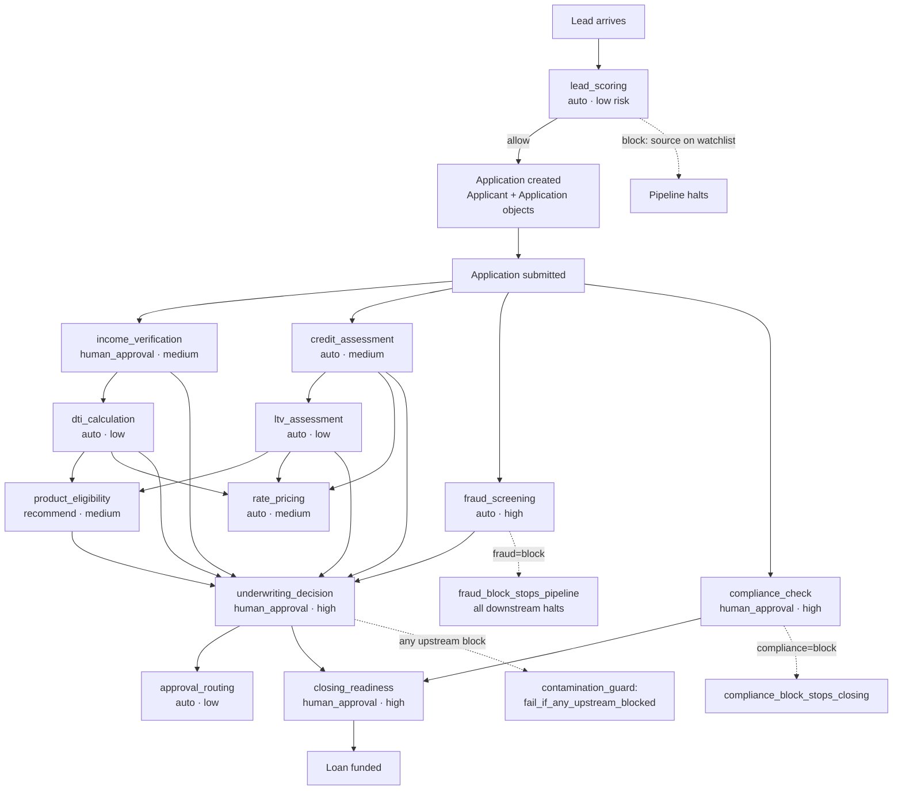
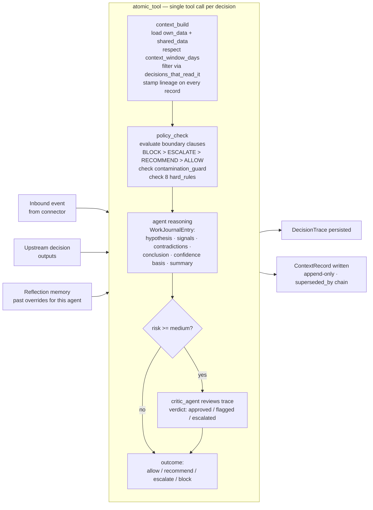
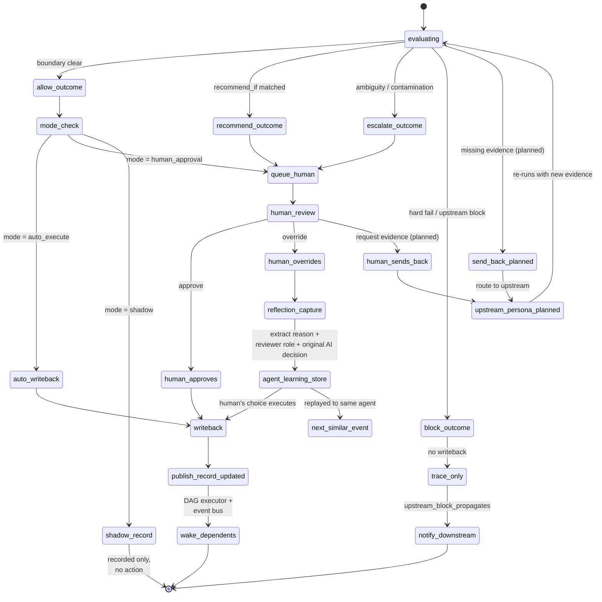
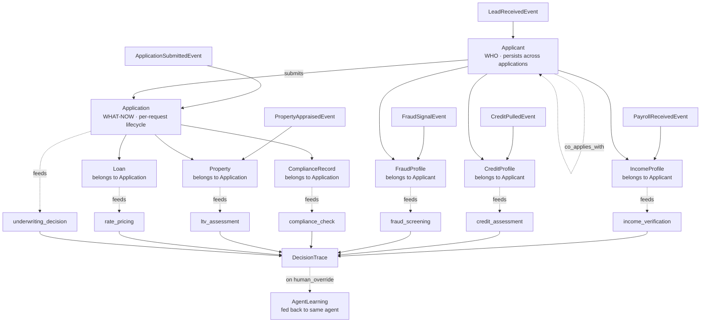
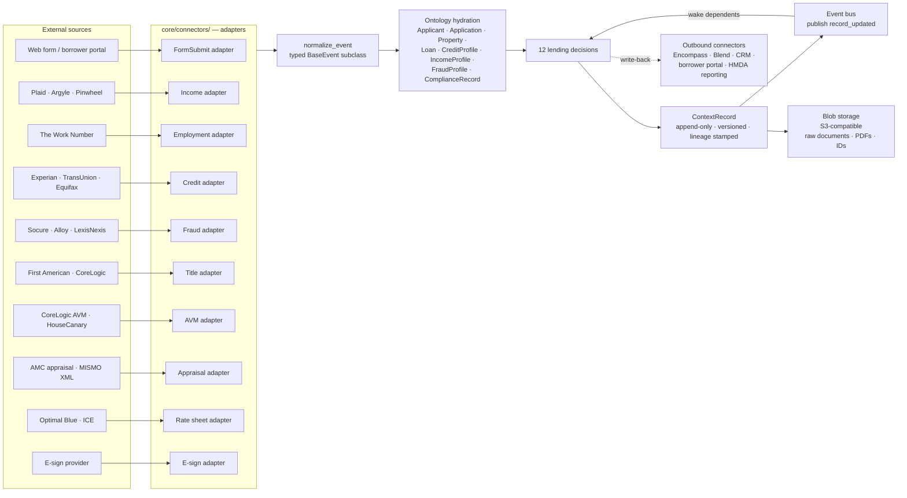

# Decision OS — Product Requirements Document

**Version:** 0.1 (initial draft)
**Last updated:** 2026-05-01
**Status:** Draft. Generated from CONTEXT.md, decisions.yaml, knowledge_base.json,
and conversation history. **Not yet validated against customer interviews,
competitive analysis, or written non-functional requirements.**
Open questions are flagged in §17. Resolve those before treating this as a
contract.

For visual / diagrammatic flow of the full mortgage lifecycle, decision
internals, outcome routing, ontology, and connector data flow, see §11.

---

## 1. Background and motivation

Decision OS is a governed, explainable, human-in-the-loop decision platform
inspired by Palantir Foundry but built for mid-market enterprises that
cannot afford or operationally absorb Palantir's stack.

The builder spent two years implementing Palantir at a mortgage lending
company across 12 decision personas spanning the full mortgage cycle.
Surfaced pain points:

- **Cost** — Foundry licensing and infrastructure overhead is mid-market-prohibitive.
- **Rigidity** — every change requires Foundry-trained engineers; ops cannot
  self-configure.
- **No explainability** — decisions are opaque to auditors, compliance officers,
  and the humans who own them.
- **No-code gap** — domain experts cannot author or modify decisions without
  writing TypeScript or PySpark transforms.

Decision OS is the answer: Palantir's *capability* (governed decisions over
heterogeneous data with full ontology, lineage, and human-in-the-loop) without
Palantir's *price* or *engineering tax*.

---

## 2. Problem statement

Mid-market enterprises in ops-heavy domains (lending, insurance, HR, claims)
make N decisions per workflow. Each decision needs:

- Data from multiple disparate external sources
- Domain semantics that are not in the source system
- A clear policy (when to act, when to escalate, when to block)
- A complete audit trail
- Human override capability
- Coordination with upstream and downstream decisions

Today they cobble it together in spreadsheets, custom microservices, ML models
without governance, and BPM tools that do not carry context. The result:
untraceable decisions, compliance risk, and low autonomy.

---

## 3. Goals

### P0 — must have for v1

- **Domain pack model** — customer brings a domain, defines decisions in YAML,
  the system runs them.
- **Atomic-tool decision pattern** with full structured trace.
- **Boundary engine** with hard rules + per-decision policy.
- **Ontology layer** with semantic links and permissioned reads.
- **Lineage-tracked, append-only context store**.
- **Independent critic** for medium and high risk decisions.
- **Reflection** — capture human overrides as agent memory.
- **Connector framework** for arbitrary external sources.
- **Persona workbench** for human review and override.

### P1 — after v1

- Multi-domain support beyond lending (insurance, HR pilot).
- Self-serve no-code domain pack authoring (UI editor for decisions.yaml + ontology).
- Outbound connectors for write-back to LOS / CRM / downstream systems.
- Reflection runtime: feed override learnings back into next decision.
- Simulation / what-if mode.

### P2 — longer term

- Decision branching (Foundry-style scenario forks).
- Multi-tenant SaaS deployment.
- Cross-domain decision libraries (compliance pack, fraud pack).

---

## 4. Non-goals

- Replicating Foundry-scale analytics (petabyte data lake, BI tooling, code
  workbooks for ML training).
- General-purpose ML platform — Decision OS is for *bounded* decisions, not
  unbounded ML pipelines.
- Replacing the LOS / source system of record — we orchestrate and govern;
  we do not own the loan record.
- Replacing existing risk models (FICO, AUS findings) — we consume their
  outputs as context.

---

## 5. Target users (assumed; needs validation)

- **Primary buyer:** VP Operations / VP Risk at a mid-market lender ($500M–$10B
  annual origination).
- **End users:**
  - Decision owners — income reviewer, compliance officer, underwriter,
    closing agent — using the persona workbench.
  - Domain modelers — ops/product — authoring decisions.yaml and ontology.
  - Engineers integrating new data sources via the connector framework.
- **Anti-personas:**
  - Tier-1 banks with existing Foundry deployments.
  - Pure FinTech disruptors with one-size-fits-all auto-decisioning.
  - Solo brokers — too small.

---

## 6. Solution overview

Decision OS is a Python + Postgres + Redis backend with a Next.js workbench.
Core abstractions:

| Abstraction | What it is |
|---|---|
| **Decision** | A unit of work that takes context, evaluates a boundary, emits an outcome. |
| **Persona** | The agent (AI or human) that runs a decision. |
| **Boundary** | Declarative policy (allow / recommend / escalate / block clauses) per decision. |
| **Atomic tool** | Bundled context_build + policy_check + decision per decision, exposed as one tool call. |
| **Context store** | Append-only, lineage-tracked record of every input to every decision. |
| **Ontology** | Typed object model with semantic links, governing what each decision can read. |
| **Trace** | WorkJournalEntry per decision (hypothesis, signals, contradictions, conclusion). |
| **Critic agent** | Independent reviewer of medium+ risk decisions. |
| **Reflection** | Capture of human overrides, replayed to the same agent on similar future events. |
| **Connector** | Adapter from external source → typed event → ontology object hydration. |

---

## 7. Architectural principles

The four principles that distinguish Decision OS from a generic ML pipeline
or workflow engine.

1. **Atomic tool pattern** — context_build, policy_check, and decision are
   bundled into ONE tool call per agent. The LLM reasons within boundaries;
   deterministic work happens in code.
2. **Context window per decision** — `context_window_days` limits history
   loaded per agent. Focuses attention; prevents context contamination from
   ancient signals.
3. **Reflection loop** — every human override becomes an `agent_learning`
   record, fed back to the same agent on the next similar event. The override
   log becomes per-agent memory; the system improves without retraining.
4. **WorkJournalEntry trace** — agents produce structured reasoning
   (hypothesis tested, signals evaluated, contradictions found, conclusion,
   confidence basis, human-readable summary) — not free-text logs. An
   independent critic reviews the journal.

---

## 8. Hard rules (cross-cutting invariants)

Every decision must satisfy these or refuse to act:

1. `no_decision_without_owner` — every decision has a named `owner_team`.
2. `no_action_without_policy` — default outcome is ESCALATE if no boundary
   matches.
3. `no_context_without_lineage` — every ContextRecord carries full Lineage.
4. `no_agent_without_permissions` — agents can only read objects in
   `decisions_that_read_it`.
5. `no_execution_without_trace` — `trace_required=true` enforced before
   write-back.
6. `fraud_block_stops_pipeline` — fraud=BLOCK halts all downstream.
7. `compliance_block_stops_closing` — compliance=BLOCK halts closing_readiness.
8. `upstream_block_propagates_to_dependents` — any upstream BLOCK propagates.

---

## 9. Decision modes

Per decision, exactly one of:

- **`shadow`** — agent runs, decision recorded, no action taken (for evaluation
  before going live).
- **`recommend`** — agent decision shown to human; human acts.
- **`human_approval`** — agent decides, human signs before write-back.
- **`auto_execute`** — agent decides and writes back without human gate
  (low risk only, with limited use for medium risk).

The boundary engine returns a *policy outcome*; the mode determines whether
that outcome executes immediately or queues for human review.

---

## 10. Domain pack: Lending (mortgage)

12 decisions covering the full mortgage cycle. Source of truth:
`domains/lending/decisions.yaml`. Knowledge base: `domains/lending/knowledge_base.json`.

### Independent (run in parallel after application submitted)
1. `lead_scoring` — auto, low risk
2. `income_verification` — human_approval, medium risk
3. `credit_assessment` — auto, medium risk
4. `fraud_screening` — auto, high risk (hard-block authority)
5. `compliance_check` — human_approval, high risk

### Dependent (sequential, gated by upstream)
6. `dti_calculation` — auto, low (depends on income_verification)
7. `ltv_assessment` — auto, low (depends on credit_assessment)
8. `product_eligibility` — recommend, medium (depends on DTI + LTV)
9. `rate_pricing` — auto, medium (depends on credit + DTI + LTV)
10. `underwriting_decision` — human_approval, high (depends on all upstream)
11. `approval_routing` — auto, low (depends on underwriting)
12. `closing_readiness` — human_approval, high (depends on underwriting + compliance)

---

## 11. Visual flow — end-to-end

Mermaid diagrams render in GitHub markdown, VS Code (with the Mermaid
extension), GitLab, Notion, and most modern IDEs. These are the visual
companion to §10 (lending decisions), §8 (hard rules), §9 (decision modes),
§12 (ontology), and §13 (connectors).

### 11.1 End-to-end pipeline — lead to closing

Full mortgage lifecycle. Phase 0 captures pre-application; Phase 1 runs the
five independent decisions in parallel; Phase 2 fires the dependent
decisions in order as upstream completes; Phase 3 closes the loan. The
dotted lines show hard-rule short-circuits.

### 11.2 Per-decision pattern — the atomic tool

Every decision has the same internal shape: load context within the
decision's window and permission scope, evaluate the boundary, agent
reasons inside the policy guardrails, critic reviews if risk is medium+,
emit outcome. This is the atomic_tool pattern from §7 principle 1.

### 11.3 Outcome routing — approve, send back, trigger next

What happens after the boundary fires. The mode determines whether the
outcome executes immediately or queues for human review. Overrides flow
into reflection. Successful write-backs publish to the event bus, waking
downstream dependents. The "send back" path (request more evidence) is
planned but not yet built — flagged dotted.

### 11.4 Object lifecycle through the pipeline

How ontology objects come into existence and feed each decision. Reinforces
the WHO (Applicant, persistent) vs WHAT-NOW (Application, lifecycle-bound)
distinction from §12.

### 11.5 Connector → decision data flow

How external sources feed the pipeline. The connector framework normalizes
heterogeneous external payloads into typed events, hydrates ontology
objects, and writes ContextRecords with full lineage. The event bus wakes
downstream when an upstream record is superseded.

---

## 12. Ontology

8 business object types + 3 system object types.

**Business objects** (lending domain):
Applicant · Application · Property · Loan · CreditProfile · IncomeProfile ·
FraudProfile · ComplianceRecord

**System objects** (decision pipeline runtime):
Decision · DecisionTrace · AgentLearning

### Key invariants

- **Applicant is WHO** — persists across applications.
- **Application is WHAT THEY ARE ASKING FOR NOW** — lifecycle-bound; new on
  each request.
- **Profiles attach to Applicant**, not Application — re-applications inherit
  verified state within retention.
- **DTI / LTV / product eligibility / underwriting attach to Application**
  (and to its Loan).
- **ComplianceRecord and Property attach to Application** — regulatory and
  asset snapshots are per-application.

---

## 13. Data integration — connector framework

Mid-market scope means we do not need HDFS or Foundry's Magritte. The
connector framework is the cost differentiator.

- **Inbound connectors** — adapter per external source. Reference vendors
  for lending: Plaid (income/bank), Experian / TransUnion / Equifax (credit),
  Socure / Alloy / LexisNexis (fraud), First American / CoreLogic (title +
  AVM), Optimal Blue / ICE (rate sheets), The Work Number (employment).
- **Trigger modes** — webhook (push), cron pull, API on-demand, manual upload.
- **Normalization** — each connector emits typed events through
  `normalize_event()`; downstream code does not care about the source.
- **Storage** — Postgres for entities + ContextRecord versions + JSONB raw
  payloads; S3-compatible blob store for documents (paystubs, IDs,
  appraisals, signed disclosures); Redis for hot context cache.
- **Outbound connectors** — write-back to LOS (Encompass, Blend), CRM,
  borrower portal, compliance reporting.

---

## 14. Tech stack

- Backend: Python 3.11 + FastAPI
- Models: Pydantic v2
- Database: Postgres (Supabase managed in early phases)
- Cache: Redis
- Blob storage: S3-compatible
- Frontend: Next.js + Tailwind
- Deployment: Docker Compose (local); cloud target TBD

---

## 15. Non-functional requirements — NEEDS VALIDATION

Placeholders pending customer discovery. Treat as assumptions, not contracts.

| Dimension | Assumed value |
|---|---|
| Volume | 1k–10k applications/month per tenant |
| Latency (per-decision SLA) | 5s–300s (in decisions.yaml) |
| End-to-end loan decisioning | < 24 hours typical |
| Availability | 99.5% target |
| Tenancy | Single-tenant in v1; multi-tenant in v2 |
| Data residency | Per-customer, TBD |
| Compliance certifications | SOC 2 Type II post-v1; HMDA / ECOA / state rules built into lending domain pack |

---

## 16. Build sequence

Reflects current state. See CONTEXT.md for live build status.

### Foundation (mostly done)

- ✅ `domains/lending/decisions.yaml` — 12 decisions specced
- ✅ `core/normalizer/models.py` — event + entity Pydantic models
- ✅ `domains/lending/knowledge_base.json` — vocabulary + ontology
- ✅ `core/semantic_layer/resolver.py` — synonym resolver
- ✅ `core/policy_engine/evaluator.py` — boundary evaluator + hard rules
- ✅ `core/trace/trace_schema.py` — DecisionTrace + WorkJournalEntry
- ✅ `core/trace/critic_agent.py` — independent critic
- ✅ `core/ontology/object_types.py` — 8 object types with semantic links
- ⏳ `core/context_store/base.py` + `lending.py` — interface only; needs
  Redis + Postgres impls

### Next, in priority order

1. **Finish context_store** — `redis_cache.py`, `postgres_store.py`,
   `schema.sql`.
2. **Connector framework** — `core/connectors/base.py` + 1–2 reference
   adapters (e.g., Plaid Income, mock CSV connector for development).
3. **Decision agents** — `core/decision_agents/` — base agent class +
   12 persona implementations + atomic_tool functions.
4. **DAG executor + event bus** — orchestrator that walks
   `execution_order` and publishes record_updated events to wake dependents.
5. **FastAPI layer** — `/events`, `/decisions/:id/evaluate`, `/trace/:id`,
   `/override`, `/connectors/webhook/:source`.
6. **Reflection runtime** — extractor + AgentLearning store + replay-into-next-decision.
7. **Persona workbench UI** — Next.js + Tailwind, per-persona queue, evidence
   panel, decision form, override button, trace viewer.

---

## 17. Open questions

These need answers before architecture stabilizes.

- **Target customer profile** — community lender, credit union, non-bank
  originator, IMB? Volume tier?
- **Pricing model** — per-decision, per-application, flat platform fee,
  freemium for the domain pack editor?
- **Competitive positioning** — vs Blend, ICE Mortgage Technology, nCino,
  custom in-house. What's the wedge — price, no-code, explainability, or
  domain pack reuse?
- **First reference customer** — who, by when?
- **Multi-tenancy timeline** — v2 may be too late if first customers cluster.
- **Regulatory certifications timeline** — SOC 2, HMDA reporting integration.
- **AI model strategy** — bring-your-own LLM? Anthropic-only? Self-host
  option for regulated buyers?
- **Override authority model** — who can override what? Is there a separate
  sign-off workflow above human_approval (e.g., dual-control for compliance
  blocks)?
- **"Request more evidence" outcome** — needs to be modeled if loan officers
  should be able to bounce back to upstream personas with a specific evidence
  request.
- **Connector marketplace strategy** — do we build all the integrations, or
  open an SDK so customers / partners build their own?
- **Failure / disaster recovery posture** — what's the RPO / RTO target?

---

## 18. Glossary

Brief; full vocabulary is in `domains/lending/knowledge_base.json`.

- **Atomic tool** — bundled context_build + policy_check + decision exposed
  as one tool call.
- **Boundary** — per-decision policy block defining allow / recommend /
  escalate / block clauses.
- **Contamination guard** — refuses to act if upstream confidence is below
  threshold or any upstream is blocked.
- **Decision pack / domain pack** — set of decisions, ontology, and rules
  for one vertical.
- **Lineage** — full provenance trail attached to every ContextRecord.
- **Persona** — the named agent (AI or human) that runs a decision.
- **Reflection** — capture-and-replay of human overrides as agent learnings.
- **WorkJournalEntry** — structured reasoning artifact (hypothesis,
  signals, contradictions, conclusion, confidence basis, human-readable
  summary) replacing free-text logs.

---

## Appendix A — How this PRD was generated

Sources used:

- `CONTEXT.md` — vision, tech stack, build status, ontology decisions
- `domains/lending/decisions.yaml` — the 12 decisions, modes, boundaries,
  hard rules, reflection block
- `domains/lending/knowledge_base.json` — ontology, vocabulary, dependency
  graph
- Existing code in `core/` — policy engine grammar, trace schema, ontology
  classes, context store interface
- Conversation history — architectural intent communicated by the builder
  during sessions on 2026-04-30 and 2026-05-01

Sources NOT used (because they do not exist yet):

- Customer interviews
- Competitive analysis
- Written non-functional requirements
- Procurement constraints from a target customer
- Pricing or go-to-market plan

Treat the unvalidated sections (§5 target users, §15 NFRs, §17 open questions)
accordingly. Validate before locking in architecture decisions that depend
on them.
