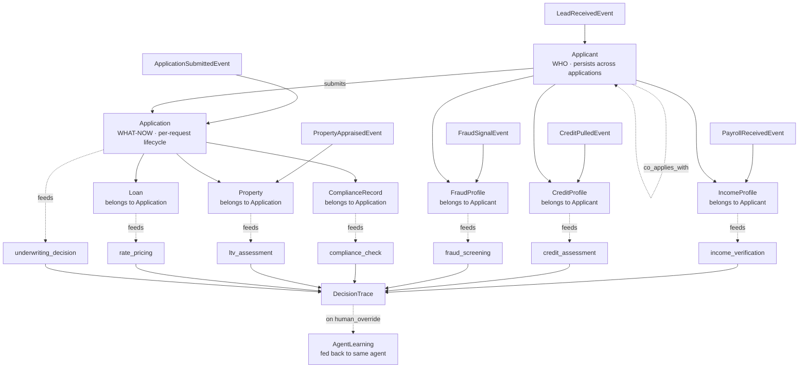
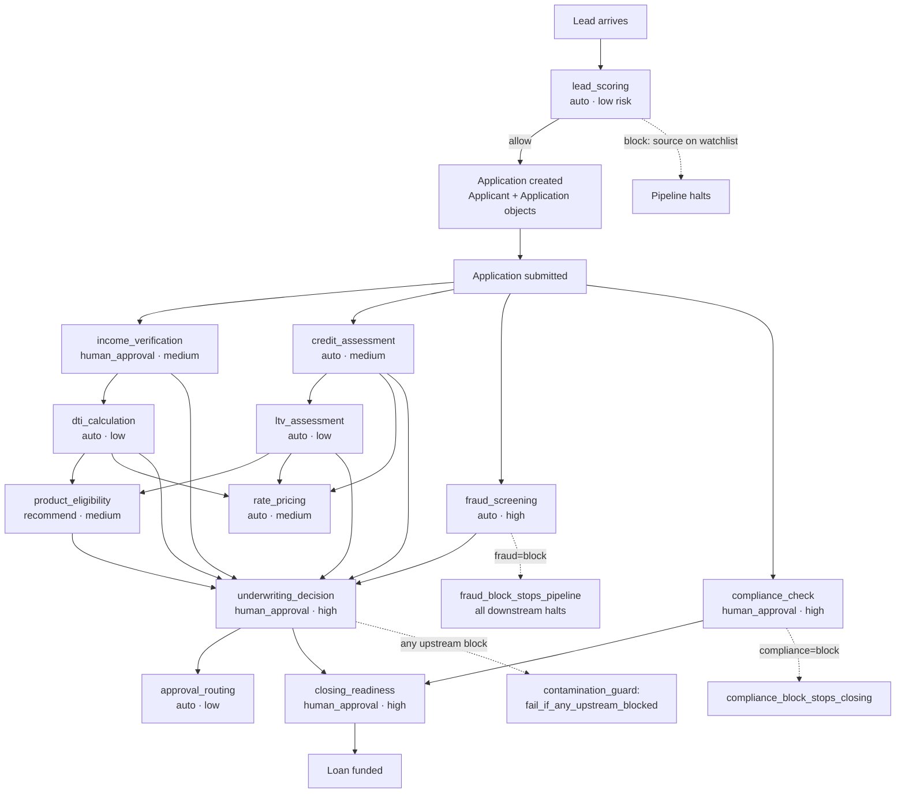
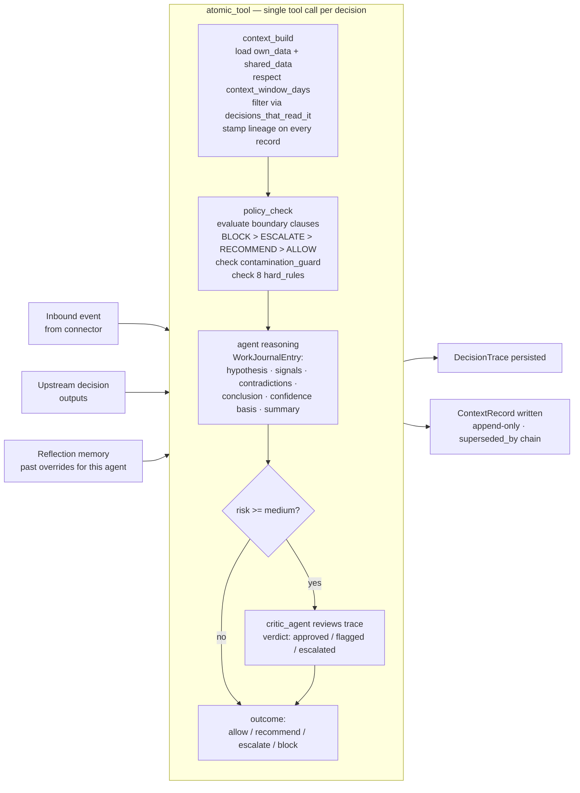
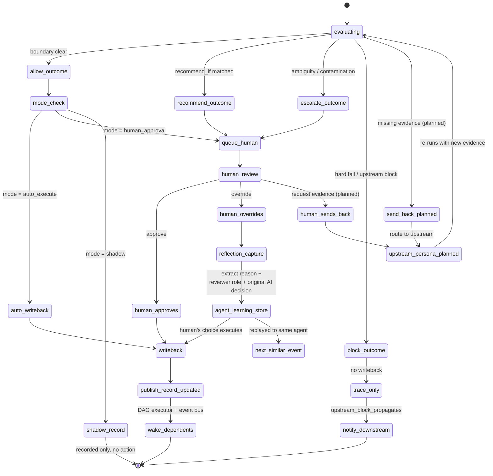
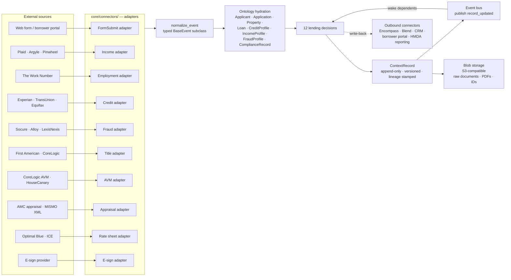

# DECISION OS — PRODUCT REQUIREMENTS DOCUMENT
# Version: 0.5 | Updated: May 2026 | Source of truth for Claude Code every session

---

## HOW TO USE THIS FILE

This file is the single source of truth for Claude Code.
At the start of every session, read this file + CONTEXT.md + decisions.yaml.
Do not ask what the project is. Do not ask what was built last. Read these files and know.

---

## 1. WHAT WE ARE BUILDING — ONE PARAGRAPH

Decision OS is a platform for structured, governed, AI-augmented decisioning.
Any business brings their domain, maps their decisions (independent and dependent),
connects their data sources, and the platform builds context, evaluates policy,
runs AI agents, enforces governance, and produces a complete explainable trace
for every decision made. Every decision has an owner, a boundary, a mode, and a trace.
No decision is a black box. No action happens without a policy. No context is untracked.

---

## 2. THE CORE INSIGHT

```
Decisions are not random.
They have STRUCTURE    — independent or dependent on other decisions
They have OWNERS       — a team accountable for every outcome
They have DATA         — own data + shared data + upstream outputs
They have DEPENDENCIES — some decisions gate others
They have RISK         — low / medium / high drives the decision mode
They have A TRACE      — every decision is a work journal, not a log
```

---

## 3. THE 6 BUILDING BLOCKS (applies to every domain)

```
┌─────┬──────────────────────────────┬──────────────────────────────────────────────────┐
│ 01  │ DATA LAYER                   │ Own data per decision. Shared data across domain. │
│     │                              │ External sources via connectors. Full lineage.    │
├─────┼──────────────────────────────┼──────────────────────────────────────────────────┤
│ 02  │ KNOWLEDGE BASE + SEMANTICS   │ Controlled vocabulary. Synonyms → canonical.     │
│     │                              │ Business definitions. Thresholds per term.        │
├─────┼──────────────────────────────┼──────────────────────────────────────────────────┤
│ 03  │ ONTOLOGY                     │ Object types + properties + semantic links.       │
│     │                              │ WHO vs WHAT-NOW. Permissioned reads per decision. │
├─────┼──────────────────────────────┼──────────────────────────────────────────────────┤
│ 04  │ CONTEXT ENGINE               │ Builds only the context each decision needs.      │
│     │                              │ context_window_days. Upstream outputs injected.   │
├─────┼──────────────────────────────┼──────────────────────────────────────────────────┤
│ 05  │ BOUNDARY + POLICY            │ automate_if / recommend_if / escalate_if /        │
│     │                              │ block_if — declarative, in config not code.       │
├─────┼──────────────────────────────┼──────────────────────────────────────────────────┤
│ 06  │ AGENTS + GOVERNANCE          │ AI reasons. Code enforces. Atomic tool pattern.   │
│     │                              │ Independent critic. Reflection loop. Full trace.  │
└─────┴──────────────────────────────┴──────────────────────────────────────────────────┘
```

---

## 4. ARCHITECTURE — FULL PIPELINE (text)

```
SOURCE SYSTEMS
  Apps | APIs | CRM | ERP | Streams | Files | Webhooks | Voice
           │
           ▼
  ┌─────────────────────────────┐
  │   FLOW LISTENER / ADAPTERS  │  One adapter per source type
  │   core/connectors/          │  Emits RawEvent objects only
  └──────────────┬──────────────┘
                 │
                 ▼
  ┌─────────────────────────────┐
  │   EVENT NORMALIZER          │  RawEvent → typed NormalizedEvent
  │   core/normalizer/          │  Pydantic v2. Strict validation.
  │   models.py                 │  Reject malformed → dead letter store
  └──────────────┬──────────────┘
                 │
                 ▼
  ┌─────────────────────────────┐
  │   SEMANTIC LANGUAGE LAYER   │  Synonym → canonical resolution
  │   core/semantic_layer/      │  "dti" → debt_to_income_ratio
  │   resolver.py               │  Loads knowledge_base.json
  └──────────────┬──────────────┘
                 │
                 ▼
  ┌─────────────────────────────┐
  │   SEMANTIC FLOW LAYER       │  Event → entity → metric → signal
  │   core/semantic_layer/      │  Maps raw events to business meaning
  │   flow.py                   │  Before context is built
  └──────────────┬──────────────┘
                 │
                 ▼
  ┌─────────────────────────────┐
  │   MINI CONTEXT STORES       │  Redis: hot cache, TTL per decision
  │   core/context_store/       │  Postgres: durable history + lineage
  │   base.py / lending.py      │  One store per entity type
  └──────────────┬──────────────┘
                 │
                 ▼
  ┌─────────────────────────────┐
  │   CONTEXT AGENT             │  Assembles context bundle for decision
  │   core/context_store/       │  Respects context_window_days
  │   context_builder.py        │  Injects upstream decision outputs
  └──────────────┬──────────────┘
                 │
          ┌──────┴──────────────────────────────┐
          │         ATOMIC TOOL (per decision)  │
          │  ┌──────────────────────────────┐   │
          │  │ 1. POLICY CHECK              │   │
          │  │    core/policy_engine/       │   │
          │  │    → allow/recommend/        │   │
          │  │      escalate/block          │   │
          │  ├──────────────────────────────┤   │
          │  │ 2. DECISION AGENT            │   │
          │  │    core/decision_agents/     │   │
          │  │    Produces WorkJournalEntry │   │
          │  ├──────────────────────────────┤   │
          │  │ 3. CRITIC AGENT (med+high)   │   │
          │  │    core/trace/               │   │
          │  │    SelfReviewError enforced  │   │
          │  └──────────────────────────────┘   │
          └──────┬──────────────────────────────┘
                 │
                 ▼
  ┌─────────────────────────────┐
  │   OWNERSHIP + MODE LAYER    │  shadow/recommend/human_approval/auto
  └──────────────┬──────────────┘
                 │
         ┌───────┴───────────────┐
         ▼                       ▼
  ┌────────────────┐    ┌────────────────────┐
  │  AUTO EXECUTE  │    │   HUMAN QUEUE      │
  │  Write-back    │    │   Persona workbench │
  └───────┬────────┘    └─────────┬──────────┘
          └──────────┬────────────┘
                     ▼
  ┌─────────────────────────────┐
  │   DECISION TRACE            │  Append-only. Never deleted.
  │   core/trace/trace_schema.py│  WorkJournalEntry + critic result
  └──────────────┬──────────────┘
                 │
                 ▼
  ┌─────────────────────────────┐
  │   OUTCOME LEARNING          │  Human override → AgentLearning
  │   core/trace/reflection.py  │  Fed back to same agent next time
  └──────────────┬──────────────┘
                 │
                 ▼
  ┌─────────────────────────────┐
  │   SIMULATION LAYER          │  Replay. Test. Compare. A/B.
  └─────────────────────────────┘

  CROSS-CUTTING:
  ┌────────────────────────────────────────────────────────────────────┐
  │  Governance | Security | Observability | Cost-per-decision | Perf  │
  └────────────────────────────────────────────────────────────────────┘
```

---

## 5. HARD RULES — ENFORCED IN CODE, NOT PROMPTS

```
┌──────────────────────────────────────────────┬───────────────────────────────────────────┐
│ RULE                                         │ ENFORCEMENT                               │
├──────────────────────────────────────────────┼───────────────────────────────────────────┤
│ no_decision_without_owner                    │ Validate owner_team at decision load time │
│ no_action_without_policy                     │ Default outcome = ESCALATE if no match    │
│ no_context_without_lineage                   │ Every ContextRecord carries Lineage obj   │
│ no_agent_without_permissions                 │ Agents read only decisions_that_read_it   │
│ no_execution_without_trace                   │ trace_required=true gated before writeback│
│ fraud_block_stops_pipeline                   │ fraud=BLOCK halts ALL downstream          │
│ compliance_block_stops_closing               │ compliance=BLOCK halts closing_readiness  │
│ upstream_block_propagates_to_dependents      │ contamination_guard in every dep decision │
└──────────────────────────────────────────────┴───────────────────────────────────────────┘
```

---

## 6. DECISION MODES

```
  shadow         → agent runs, outcome recorded, NOTHING executes
  recommend      → agent surfaces recommendation, human acts
  human_approval → agent decides, human must sign before writeback
  auto_execute   → agent decides and writes back immediately
```

---

## 7. ATOMIC TOOL PATTERN

```
  LLM: reasons within boundaries, produces WorkJournalEntry
       does NOT: validate data, enforce rules, write to DB

  CODE (one bundled tool call — cannot call steps separately):
    context_build  → assembles typed context bundle
    policy_check   → evaluates boundary clauses + all 8 hard rules
    trace_write    → persists WorkJournalEntry + DecisionTrace
    mode_route     → executes or queues based on mode
```

---

## 8. FOUR ARCHITECTURAL PRINCIPLES

```
  1. AI REASONS. CODE GOVERNS.
     Every hard rule backed by code, not a prompt instruction.

  2. CONTEXT IS FOCUSED, NOT FLOODED.
     context_window_days limits history. Agents get only what they need.

  3. EVERY OVERRIDE IS A LESSON.
     Human override → AgentLearning → fed back same agent next time.

  4. EVERY DECISION IS A WORK JOURNAL.
     WorkJournalEntry: hypothesis | signals | contradictions |
                       conclusion | confidence_basis | summary
     Independent critic reviews medium+ risk before execution.
```

---

## 9. ONTOLOGY — OBJECT TYPES AND RELATIONSHIPS

### 9.1 The key distinction

```
  APPLICANT = WHO
    Persists across time and across multiple Applications.
    CreditProfile, IncomeProfile, FraudProfile belong to Applicant.

  APPLICATION = WHAT THEY ARE ASKING FOR RIGHT NOW
    Lifecycle-bound. DTI, LTV, underwriting belong to Application.
    Re-application = same Applicant, brand new Application object.
```

### 9.2 Object types

```
┌──────────────────┬────────────┬──────────────────────────────────────────────────────┐
│ Object           │ Category   │ Semantic definition                                  │
├──────────────────┼────────────┼──────────────────────────────────────────────────────┤
│ Applicant        │ Business   │ WHO. Persists. Root of domain.                       │
│ Application      │ Business   │ WHAT-NOW. Lifecycle-bound.                           │
│ Property         │ Business   │ Collateral. Bound to one Application.                │
│ Loan             │ Business   │ Financing terms requested.                           │
│ CreditProfile    │ Business   │ Belongs to Applicant. One per bureau pull.           │
│ IncomeProfile    │ Business   │ Belongs to Applicant. verified_income authoritative. │
│ FraudProfile     │ Business   │ Belongs to Applicant. Shared across Applications.    │
│ ComplianceRecord │ Business   │ Belongs to Application. Regulatory artefact.         │
│ Decision         │ System     │ Runtime output per decision type per Application.    │
│ DecisionTrace    │ System     │ Work journal. Append-only. Never deleted.            │
│ AgentLearning    │ System     │ Lesson from human override. Replayed to same agent.  │
└──────────────────┴────────────┴──────────────────────────────────────────────────────┘
```

### 9.3 Semantic link map (text)

```
  Applicant  ──submits──────────────►  Application       (1 → many)
  Applicant  ──has──────────────────►  CreditProfile     (1 → many, one per pull)
  Applicant  ──has──────────────────►  IncomeProfile     (1 → many)
  Applicant  ──has──────────────────►  FraudProfile      (1 → many)
  Applicant  ──co_applies_with──────►  Applicant         (self-referential)
  Application ──secured_by──────────►  Property          (1 → 1)
  Application ──requests────────────►  Loan              (1 → 1)
  Application ──evaluated_by────────►  Decision          (1 → 12, one per type)
  Application ──governed_by─────────►  ComplianceRecord  (1 → 1)
  Decision    ──depends_on──────────►  Decision          (dependency graph)
  Decision    ──produces────────────►  DecisionTrace     (1 → 1)
  DecisionTrace ──triggers──────────►  AgentLearning     (on human override)
  AgentLearning ──feeds_back_to─────►  Decision          (same agent, next similar)
```

### 9.4 Object lifecycle — Mermaid diagram



---

## 10. ENTITY STORAGE MODEL

```
┌──────────────────┬───────────────┬──────────────────────────────────────────────────┐
│ Entity           │ Storage       │ Notes                                            │
├──────────────────┼───────────────┼──────────────────────────────────────────────────┤
│ RawEvent         │ Postgres      │ Immutable. Source of truth for replay.           │
│ NormalizedEvent  │ Postgres      │ Immutable. Indexed entity_id + event_type.       │
│ ContextBundle    │ Redis + PG    │ Redis: TTL per decision. PG: snapshot at decision.│
│ PolicyResult     │ Postgres      │ Every evaluation stored. Compliance artefact.    │
│ DecisionOutput   │ Postgres      │ Decisions table. WorkJournalEntry as JSONB.      │
│ DecisionTrace    │ Postgres      │ Append-only. Never deleted. Audit chain.         │
│ HumanQueueItem   │ Redis + PG    │ Redis: active queue. PG: full history.           │
│ AgentLearning    │ Postgres      │ 365-day retention. Similarity tags for retrieval.│
│ Applicant        │ Postgres      │ applicants table. Master record.                 │
│ Application      │ Redis + PG    │ Redis: active pipeline state. TTL 30 days.       │
│ CreditProfile    │ Redis + PG    │ Redis: latest score. TTL 90 days.               │
│ IncomeProfile    │ Redis + PG    │ Redis: verified_income + confidence. App TTL.    │
│ FraudProfile     │ Redis + PG    │ Redis: fraud_cleared flag. TTL 7 days.          │
│ Property         │ Postgres      │ No Redis — data changes infrequently.            │
│ ComplianceRecord │ Postgres      │ Regulatory artefact. Never deleted.              │
│ DecisionConfig   │ YAML file     │ decisions.yaml — source of truth for all rules.  │
└──────────────────┴───────────────┴──────────────────────────────────────────────────┘
```

---

## 11. LENDING DOMAIN — 12 DECISIONS

### 11.1 End-to-end pipeline — lead to closing — Mermaid diagram



### 11.2 Decision table

```
┌────┬──────────────────────────┬──────────────────────────────────────┬────────┬────────┬─────────────────┐
│ #  │ Decision                 │ Depends on                           │ Mode   │ Risk   │ Owner           │
├────┼──────────────────────────┼──────────────────────────────────────┼────────┼────────┼─────────────────┤
│ 01 │ lead_scoring             │ —                                    │ auto   │ low    │ Growth Ops      │
│ 02 │ income_verification      │ —                                    │ human  │ medium │ Underwriting    │
│ 03 │ credit_assessment        │ —                                    │ auto   │ medium │ Credit Risk     │
│ 04 │ fraud_screening          │ —                                    │ auto   │ HIGH   │ Fraud Ops       │
│ 05 │ compliance_check         │ —                                    │ human  │ HIGH   │ Compliance      │
│ 06 │ dti_calculation          │ income_verification                  │ auto   │ low    │ Underwriting    │
│ 07 │ ltv_assessment           │ credit_assessment                    │ auto   │ low    │ Underwriting    │
│ 08 │ product_eligibility      │ dti_calculation + ltv_assessment     │ rec    │ medium │ Product Ops     │
│ 09 │ rate_pricing             │ credit + dti + ltv                   │ auto   │ medium │ Secondary Mkts  │
│ 10 │ underwriting_decision    │ ALL above                            │ human  │ HIGH   │ Underwriting    │
│ 11 │ approval_routing         │ underwriting_decision                │ auto   │ low    │ Loan Ops        │
│ 12 │ closing_readiness        │ underwriting + compliance            │ human  │ HIGH   │ Closing Ops     │
└────┴──────────────────────────┴──────────────────────────────────────┴────────┴────────┴─────────────────┘
```

### 11.3 Hard stops

```
  fraud_screening     = BLOCK  →  STOPS ALL downstream. No exceptions.
  compliance_check    = BLOCK  →  STOPS closing_readiness. No exceptions.
  any upstream        = BLOCK  →  contamination_guard blocks all dependents.
```

---

## 12. PER-DECISION PATTERN — ATOMIC TOOL — Mermaid diagram



---

## 13. OUTCOME ROUTING — Mermaid diagram



---

## 14. CONNECTOR → DECISION DATA FLOW — Mermaid diagram



---

## 15. DECISION TRACE — WORK JOURNAL SCHEMA

```
DecisionTrace {
  trace_id:               uuid
  event_id:               uuid          FK → normalized_events
  entity_id:              string
  decision_type:          string
  context_snapshot:       jsonb         complete immutable snapshot at decision time
  policies_evaluated:     jsonb[]       [{policy_id, name, result, reason}]
  work_journal: {
    hypothesis_tested:    string        what the agent believed before signals
    signals_evaluated:    jsonb[]       [{signal, value, weight, relevance}]
    contradictions_found: jsonb[]       [{signal, contradiction, resolution}]
    conclusion:           string        reasoned conclusion from evidence
    confidence_basis:     string        why confident / what would change it
    human_readable_summary: string      plain language, non-technical reader
  }
  critic_result:          jsonb         {verdict, reasoning, flagged_issues}
  agent_id:               string
  decision_mode:          enum          shadow|recommend|human_approval|auto_execute
  outcome:                enum          allow|recommend|escalate|block
  confidence:             float         0.0–1.0
  owner_team:             string
  human_resolution:       jsonb|null    {decision, reason, reviewer_role, time_seconds}
  decided_at:             timestamp
  latency_ms:             int
}
```

---

## 16. REFLECTION LOOP — HOW THE SYSTEM LEARNS

```
  Human overrides AI decision
           │
           ▼
  Extract: original_ai_decision | human_decision | override_reason
           override_reason_code | reviewer_role | context_fingerprint
           │
           ▼
  Structure as AgentLearning:
    agent_id, decision_type, trigger=human_override
    lesson (string), similarity_tags (jsonb), retention_until (365 days)
           │
           ▼
  Next similar event → AgentLearning injected into context bundle
  Agent reasons with lesson → accuracy improves without retraining
```

---

## 17. FILE STRUCTURE — ACTUAL STATE IN REPO

These are the files that exist in the repo right now.
Verify with `find . -name "*.py" -o -name "*.yaml" -o -name "*.json" -o -name "*.sql"` before building.

```
decision-os/
├── core/
│   ├── semantic_layer/
│   │   ├── __init__.py            ✅ EXISTS
│   │   ├── resolver.py            ✅ EXISTS — synonym resolver
│   │   └── flow.py                ⬜ TODO — event → entity → signal mapper
│   ├── policy_engine/
│   │   ├── __init__.py            ✅ EXISTS
│   │   ├── evaluator.py           ✅ EXISTS — boundary evaluator + 8 hard rules
│   │   └── loader.py              ✅ EXISTS — DecisionsSpec load+validate path
│   │                                          (no_decision_without_owner, mode/risk
│   │                                          enums, depends_on integrity,
│   │                                          execution_order references)
│   ├── normalizer/                ✅ STEP 1 DONE
│   │   ├── __init__.py            ✅ EXISTS
│   │   └── models.py              ✅ EXISTS — 13 typed events + 8 entities,
│   │                                          normalize_event() + EVENT_REGISTRY,
│   │                                          correlation_id / request_id on BaseEvent
│   ├── ontology/                  ✅ STEP 2 DONE
│   │   ├── __init__.py            ✅ EXISTS
│   │   └── object_types.py        ✅ EXISTS — 8 lending object types + semantic
│   │                                          links + decisions_that_read_it +
│   │                                          to_context_bundle() projection.
│   │                                          Applicant carries lead-stage fields
│   │                                          (channel, utm_params, session_behavior,
│   │                                          prior_inquiries) for lead_scoring.
│   ├── context_store/             ✅ STEP 3 DONE
│   │   ├── __init__.py            ✅ EXISTS
│   │   ├── base.py                ✅ EXISTS — ContextStore abstract +
│   │   │                                       ContextRecord + Lineage + Snapshot
│   │   ├── lending.py             ✅ EXISTS — LendingContextStore +
│   │   │                                       DecisionScopedStore. Risk-driven TTLs.
│   │   ├── redis_cache.py         ✅ EXISTS — RedisHotCache + InMemoryHotCache
│   │   ├── postgres_store.py      ✅ EXISTS — PostgresDurableStore +
│   │   │                                       InMemoryDurableStore. Append-only,
│   │   │                                       supersession chain, tombstones,
│   │   │                                       point-in-time reads.
│   │   ├── schema.sql             ✅ EXISTS — context_records + context_snapshots,
│   │   │                                       partial unique on active row,
│   │   │                                       version uniqueness, supersession FK
│   │   └── context_builder.py     ✅ EXISTS — ContextBuilder + ContextBundle.
│   │                                          Decision-scoped projection through
│   │                                          ontology.to_context_bundle.
│   ├── connectors/                ✅ STEP 4 DONE
│   │   ├── __init__.py            ✅ EXISTS
│   │   ├── base.py                ✅ EXISTS — BaseConnector +
│   │   │                                       PushConnector (source initiates) +
│   │   │                                       PullConnector (we initiate) +
│   │   │                                       EventSink protocol + ConnectorHealth
│   │   ├── mock_csv.py            ✅ EXISTS — push reference (CSV / file drop)
│   │   └── mock_http.py           ✅ EXISTS — pull reference (RecordedResponse)
│   ├── decision_agents/           ✅ STEP 5 DONE
│   │   ├── __init__.py            ✅ EXISTS
│   │   ├── base.py                ✅ EXISTS — DecisionAgent ABC + AgentReasoning
│   │   ├── atomic_tool.py         ✅ EXISTS — bundled context_build + policy_check +
│   │   │                                       agent.reason + final policy_check +
│   │   │                                       critic + trace_write + mode_route
│   │   └── mode_router.py         ✅ EXISTS — RouteAction, HumanQueue,
│   │                                          DecisionScopedStore writeback
│   ├── execution/                 ✅ STEP 6 DONE
│   │   ├── __init__.py            ✅ EXISTS
│   │   └── dag_executor.py        ✅ EXISTS — wave executor + InMemoryEventBus +
│   │                                          fraud_block_stops_pipeline +
│   │                                          missing-upstream skip
│   ├── trace/
│   │   ├── __init__.py            ✅ EXISTS
│   │   ├── trace_schema.py        ✅ EXISTS — WorkJournalEntry + DecisionTrace
│   │   ├── critic_agent.py        ✅ EXISTS — independent critic, SelfReviewError
│   │   ├── trace_writer.py        ✅ EXISTS — TraceWriter Protocol +
│   │   │                                       InMemoryTraceWriter, append-only,
│   │   │                                       attach_human_review() side-channel
│   │   ├── reflection.py          ✅ EXISTS — STEP 8: AgentLearning +
│   │   │                                       LearningStore + ReflectionService.
│   │   │                                       capture(trace, review) → recall by
│   │   │                                       similarity tags. 365-day retention.
│   │   └── outcome_tracker.py     ⬜ TODO
│   └── simulation/                ⬜ TODO
│
├── api/                           ✅ STEP 7 DONE
│   ├── __init__.py                ✅ EXISTS
│   ├── deps.py                    ✅ EXISTS — Platform container +
│   │                                          build_default_platform()
│   ├── ingest.py                  ✅ EXISTS — EventLog + EntityHydrator
│   ├── routes.py                  ✅ EXISTS — POST /events, /override,
│   │                                          /connectors/webhook/{source};
│   │                                          GET /decisions/{app}/{decision},
│   │                                          /trace/{trace_id};
│   │                                          POST /applications/{id}/run (E2E helper)
│   └── main.py                    ✅ EXISTS — create_app() factory
│
├── domains/
│   ├── __init__.py                ✅ EXISTS
│   └── lending/
│       ├── __init__.py            ✅ EXISTS
│       ├── decisions.yaml         ✅ EXISTS — source of truth, all 12 decisions
│       ├── knowledge_base.json    ✅ EXISTS — vocabulary, ontology, dep graph
│       ├── personas/              ✅ STEP 9 DONE
│       │   ├── __init__.py        ✅ EXISTS — LENDING_PERSONA_CLASSES +
│       │   │                                  build_lending_personas()
│       │   ├── base.py            ✅ EXISTS — LendingPersona + OfflineReasoning +
│       │   │                                  Anthropic mixin (cache_control on
│       │   │                                  the system block)
│       │   ├── lead_scoring.py    ✅ EXISTS — LeadQualificationAgent
│       │   ├── income_verification.py     ✅ IncomeVerificationAgent
│       │   ├── credit_assessment.py       ✅ CreditRiskAgent
│       │   ├── fraud_screening.py         ✅ FraudDetectionAgent
│       │   ├── compliance_check.py        ✅ ComplianceAgent
│       │   ├── dti_calculation.py         ✅ DTICalculationAgent
│       │   ├── ltv_assessment.py          ✅ LTVAssessmentAgent
│       │   ├── product_eligibility.py     ✅ ProductEligibilityAgent
│       │   ├── rate_pricing.py            ✅ PricingAgent
│       │   ├── underwriting_decision.py   ✅ SeniorUnderwritingAgent
│       │   ├── approval_routing.py        ✅ WorkflowRoutingAgent
│       │   └── closing_readiness.py       ✅ ClosingAgent
│       └── seed_events/           ✅ STEP 10 DONE
│           ├── __init__.py        ✅ EXISTS — SCENARIOS manifest +
│           │                                  csv_connector / http_connector loaders
│           ├── runner.py          ✅ EXISTS — run_scenario() E2E replay
│           ├── happy_path/        ✅ events.csv + bureau_responses.json + entities.json
│           ├── fraud_block/       ✅ watchlist hit halts pipeline
│           ├── contamination/     ✅ confidence < 0.75 fires contamination_guard
│           └── compliance_block/  ✅ fair_lending_violation halts closing_readiness
│
├── docs/
│   └── PRD.md                     ✅ EXISTS — this file
│
├── ui/                            ✅ STEP 11 DONE — local UI mounted in api/main.py
│   ├── __init__.py                ✅ EXISTS — exports router + templates
│   ├── views.py                   ✅ EXISTS — view-model helpers +
│   │                                          OUTCOME_STYLES palette +
│   │                                          Jinja filters (currency, pct,
│   │                                          confidence, dt)
│   ├── routes.py                  ✅ EXISTS — 5 GET routes + override POST
│   │                                          with HTMX swap
│   └── templates/
│       ├── base.html              ✅ Tailwind + HTMX via CDN, nav
│       ├── index.html             ✅ application list with outcome counts
│       ├── application.html       ✅ DAG visualization by execution wave
│       ├── decision.html          ✅ bundle + journal + policy + critic +
│       │                            output + override + recalled lessons
│       ├── _override_card.html    ✅ form / attached-review / auto-execute states
│       ├── _override_result.html  ✅ HTMX swap target post-override
│       └── queue.html             ✅ cross-application human queue table
│
├── tests/                         ⬜ partial — only context_store has tests
│   └── core/context_store/test_in_memory.py
│
├── CONTEXT.md                     ✅ EXISTS — session history
├── docker-compose.yml             ✅ EXISTS — Postgres 16 + Redis 7 services
├── requirements.txt               ✅ EXISTS — pydantic, redis, asyncpg, pyyaml,
│                                              fastapi, uvicorn, anthropic, structlog,
│                                              httpx, pytest, pytest-asyncio,
│                                              jinja2, python-multipart
├── README.md                      ✅ EXISTS
│
│   NOT IN REPO YET:
├── infra/                         ⬜ TODO
└── .env.example                   ⬜ TODO
```

---

## 18. TECH STACK

```
  Backend:   Python 3.11 + FastAPI
  Models:    Pydantic v2
  Database:  Postgres via Supabase
  Cache:     Redis
  Blob:      S3-compatible
  Frontend:  Next.js + Tailwind
  AI:        Anthropic Claude via API
  Deploy:    Docker Compose → Railway / Render
```

---

## 19. BUILD SEQUENCE — NEXT STEPS IN ORDER

```
  ✅ DONE
     STEP 1  core/normalizer/models.py     — typed events + entities + normalize_event
     STEP 2  core/ontology/object_types.py — 8 object types + semantic links + projection
     STEP 3  core/context_store/           — Redis + Postgres + ContextBuilder.
                                            TTL per risk_level, lineage on all records,
                                            append-only with supersession + tombstones,
                                            decision-scoped read perms in projection.
     STEP 4  core/connectors/              — base + push/pull split + mock_csv + mock_http,
                                            correlation_id / request_id on BaseEvent.
     STEP 5  core/decision_agents/         — base + atomic_tool + mode_router.
                                            Bundled call enforces policy → reason →
                                            policy → critic → trace_write → mode_route.
     STEP 6  core/execution/dag_executor   — wave executor + InMemoryEventBus +
                                            fraud_block_stops_pipeline short-circuit.
     STEP 7  api/                          — FastAPI surface. POST /events,
                                            GET /decisions/{app}/{decision}, GET /trace/{id},
                                            POST /override, POST /connectors/webhook/{source},
                                            POST /applications/{id}/run.
     STEP 8  core/trace/reflection.py      — Override → AgentLearning → replay. 365d
                                            retention. attach_human_review side-channel
                                            on TraceWriter.
     STEP 9  domains/lending/personas/     — 12 concrete DecisionAgent subclasses.
                                            Deterministic offline path + opt-in Anthropic
                                            path with prompt caching on the system block.
     STEP 10 domains/lending/seed_events/  — 4 scenarios (happy_path, fraud_block,
                                            contamination, compliance_block) replayed via
                                            MockCSVConnector + MockHTTPConnector. Each
                                            scenario asserts a hard rule end-to-end.
     ALSO
        core/policy_engine/loader.py       — single load+validate path for decisions.yaml.
        api/ingest.py                      — EventLog + EntityHydrator (event → entity).

     STEP 11 ui/                           — local FastAPI + Jinja2 + HTMX +
                                            Tailwind via CDN. Mounted in api/main.py
                                            with a lifespan that auto-replays the 4
                                            seed scenarios on boot. 5 GET views +
                                            HTMX-driven override form. Picked over
                                            Next.js for ~2-session-to-v0 vs ~5;
                                            port to Next.js when there's a polished
                                            demo audience.

  NEXT
  14 tests/                       Persistent test suite — currently only context_store
                                  has scaffolding; expand to api/, personas/,
                                  seed_events, ui/ view-models. Three bugs in the
                                  last two sessions would have been single failing
                                  tests.
  -- Real Anthropic calls         Personas have the path; unproven. Boot the UI
                                  with one persona on the LLM path, see the work
                                  journal side-by-side with the offline baseline.
  12 core/trace/outcome_tracker   Live A/B + post-decision outcome scoring
  13 core/simulation/replayer     Replay traces at point-in-time for backtesting
```

---

## 20. HOW TO START EACH SESSION

Paste this prompt at the start of every Claude Code session:

```
Read these files in this order before doing anything:
1. docs/PRD.md                        ← architecture, principles, build sequence
2. CONTEXT.md                         ← session history
3. domains/lending/decisions.yaml     ← source of truth for all 12 decisions
4. domains/lending/knowledge_base.json ← vocabulary, ontology, dependency graph

Then verify what actually exists:
  find . -name "*.py" -o -name "*.yaml" -o -name "*.json" -o -name "*.sql" \
    | grep -v .git | grep -v __pycache__ | sort

Do not assume anything else exists.
Do not ask what the project is.
Read the files and know.

STEPS 1-11 are complete (sessions 3, 4, 5, 6):
  ✅ STEP 1  core/normalizer/models.py
  ✅ STEP 2  core/ontology/object_types.py
  ✅ STEP 3  core/context_store/{base,lending,redis_cache,postgres_store,
             context_builder}.py + schema.sql
  ✅ STEP 4  core/connectors/{base,mock_csv,mock_http}.py
             + correlation_id / request_id on BaseEvent
  ✅ STEP 5  core/decision_agents/{base,atomic_tool,mode_router}.py
             + core/trace/trace_writer.py
  ✅ STEP 6  core/execution/dag_executor.py
  ✅ STEP 7  api/{deps,ingest,routes,main}.py
  ✅ STEP 8  core/trace/reflection.py
             — AgentLearning + LearningStore + ReflectionService.capture/recall
             — TraceWriter.attach_human_review side-channel
  ✅ STEP 9  domains/lending/personas/ (12 concrete DecisionAgent subclasses)
  ✅ STEP 10 domains/lending/seed_events/{happy_path,fraud_block,
             contamination,compliance_block}/ + runner.py
  ✅ STEP 11 ui/{__init__.py,views.py,routes.py,templates/}
             — local FastAPI + Jinja2 + HTMX + Tailwind via CDN
             — mounted at / by api/main.py via mount_ui flag
             — lifespan auto-replays 4 scenarios on boot when seed_demo_data=True
             — 5 GET routes + HTMX-driven override
             — run: `uvicorn api.main:get_app --factory --reload`
  ✅ ALSO   core/policy_engine/loader.py (DecisionsSpec)

Verified end-to-end (in-memory backends):
  - All 4 seed scenarios replay via MockCSVConnector + MockHTTPConnector,
    DAG runs all 12 decisions, hard rules fire correctly:
      happy_path        — full pipeline runs (recommend on human-approval modes
                          since no human is in the loop in tests).
      fraud_block       — fraud_screening BLOCK halts pipeline,
                          7 dependents skipped with fraud_block_stops_pipeline.
      contamination     — income_verification confidence 0.50 below 0.75
                          → contamination_guard fires on dti_calculation.
      compliance_block  — compliance_check BLOCK propagates to closing_readiness
                          via compliance_block_stops_closing.
  - POST /override (API) and /ui/.../override (HTMX) both call
    ReflectionService.capture and produce identical AgentLearning records.
  - UI smoke (TestClient): / lists 4 apps, /ui/applications/{id} renders
    12-decision DAG, decision detail shows bundle + journal + policy + critic
    + override workbench, /ui/queue lists 16 queued items, override POST
    returns AgentLearning swap, reload shows attached review, same-outcome
    submission renders inline error.

Real-backend verification (STEPS 4-6 only) was scheduled for
Sun May 3 2026 9am PT (routine trig_013QhFbYJaViJfNybCbr3KUX). If that
PR has landed, review it; otherwise check the routine status link.
STEPS 7-11 are NOT in scope of that scheduled run — separate
verification needed when ready.

Build next, in this order:
  STEP 14 tests/                    Persistent test suite — only
                                    context_store has scaffolding today;
                                    cover api/, personas/, seed_events,
                                    ui/ view-models. Three bugs in the
                                    last two sessions would have been
                                    single failing tests.
  --      real Anthropic calls      Personas have the path
                                    (use_anthropic=True, cache_control on
                                    system block) but unproven. Boot the UI
                                    with one persona on the LLM path, see
                                    journal side-by-side with offline path.
  STEP 12 core/trace/outcome_tracker.py   Post-decision outcome scoring +
                                    live A/B comparisons.
  STEP 13 core/simulation/replayer.py     Replay traces at point-in-time
                                    for backtesting personas.
```

---

## 21. CODING STANDARDS

```
  - Pydantic v2 for ALL models. Type hints everywhere. No untyped functions.
  - Async for all I/O (FastAPI, Redis, Postgres).
  - structlog for logging. No print() in production code.
  - Every module has __init__.py.
  - Tests written alongside each module in tests/.
  - Append-only tables for events, traces, learnings. No deletes.
  - JSONB for flexible payloads. Typed columns for indexed fields.
  - Every ContextRecord has a lineage field. Non-negotiable.
  - decision_type must match decision id in decisions.yaml exactly.
  - Commit format: feat: / fix: / docs: / chore: / test:
  - Push before ending every session.
```

---

## 22. OPEN QUESTIONS

```
  1. First design partner — org type, domain, workflow?
  2. Pricing — per-decision / per-application / platform fee?
  3. Tenancy — single-tenant v1 or multi-tenant v1?
  4. Connectors — which must be live at launch vs mock?
  5. AI model — hosted API / bring-your-own / self-hosted?
  6. Override authority — single approver or dual-control for high-risk?
  7. Connector marketplace — build all or open SDK?
```

---

*Decision OS · docs/PRD.md · v0.5 · Read at the start of every Claude Code session*
