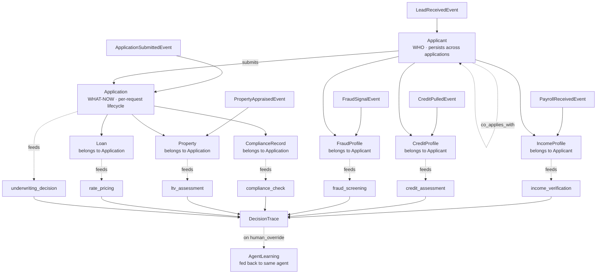
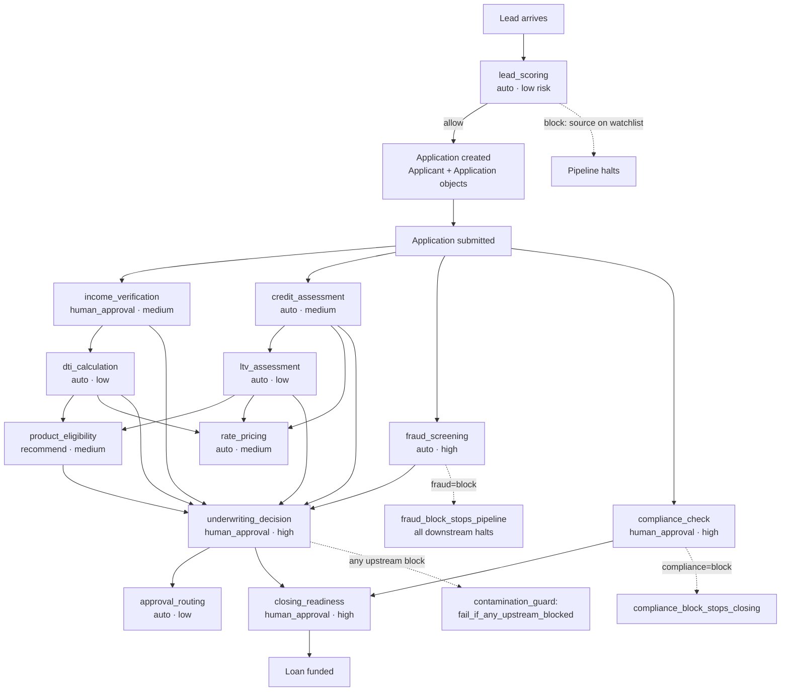
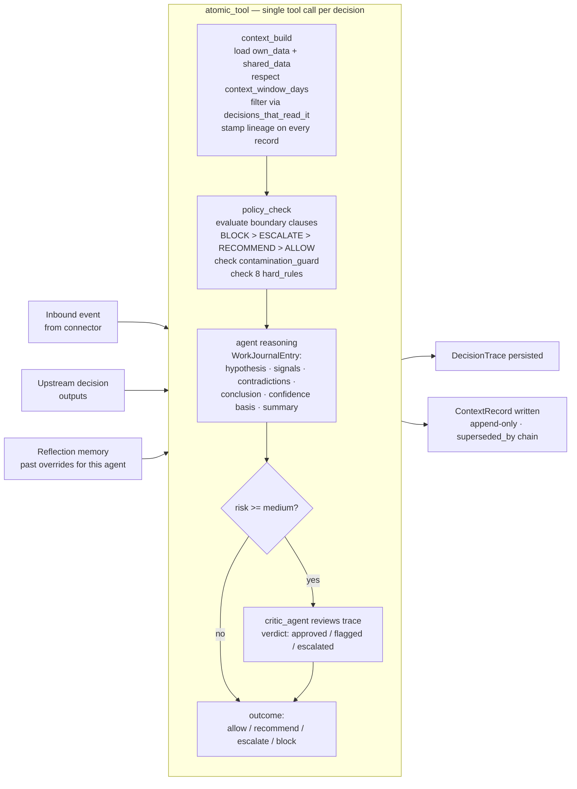
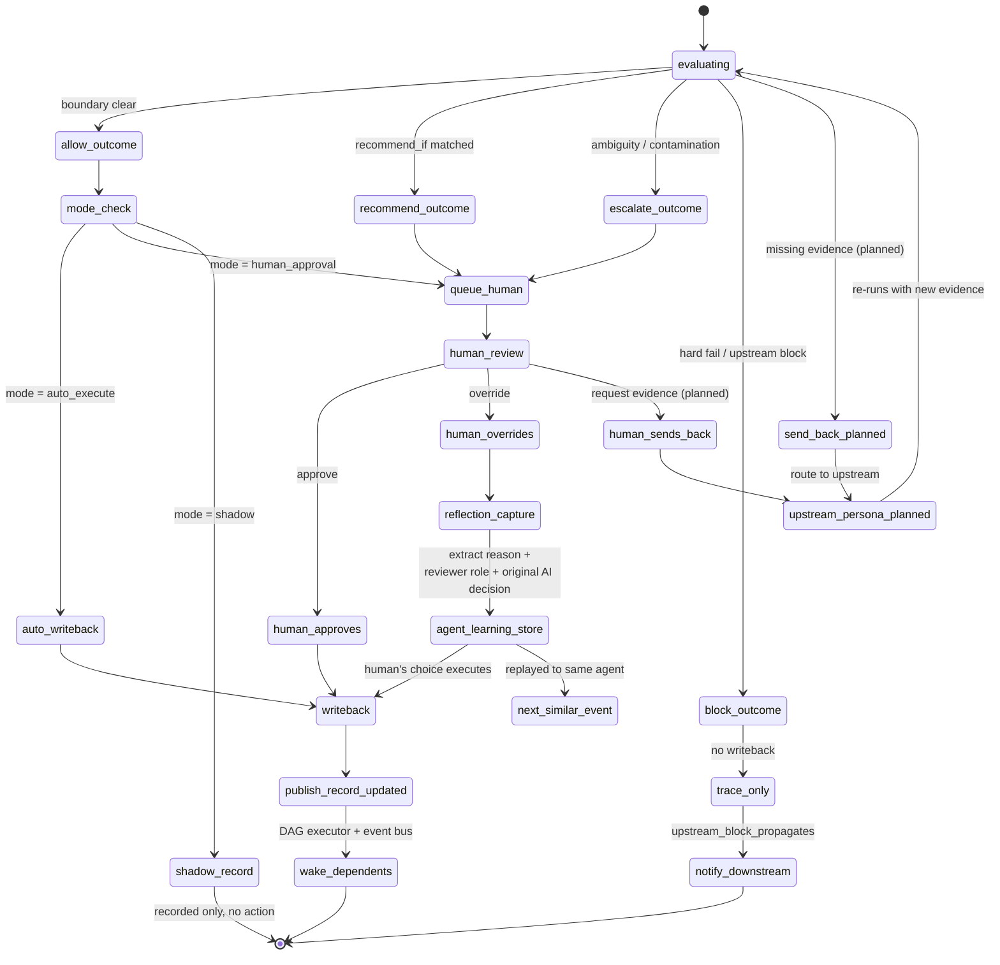
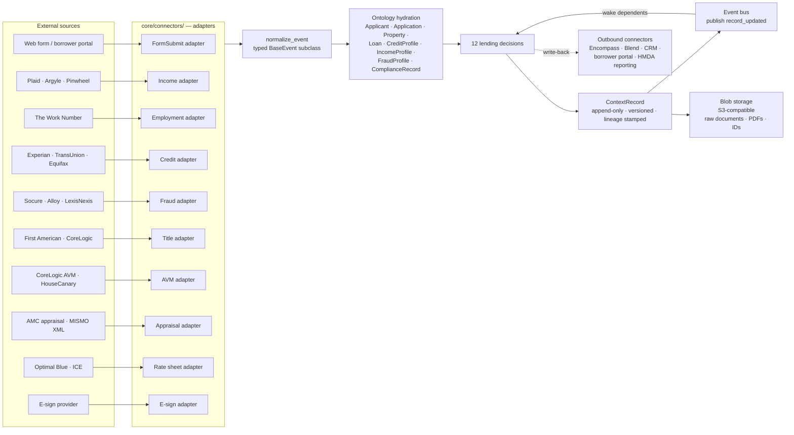

# DECISION OS — PRODUCT REQUIREMENTS DOCUMENT
# Version: 0.11 | Updated: May 2026 | Source of truth for Claude Code every session
#
# Strategic note (Session 8): the user committed to PATH C — full
# DecisionOS as system of record (12-18 month roadmap). See §19 for
# the tier breakdown that drives every following session.
#
# Session 10 deltas (v0.10 → v0.11) [22 commits, 350/350 tests]:
#   - PRD §23 Audit Engine landed end-to-end:
#     - core/audit/{schema,engine,store,alerts,pii_log}.py + 4 checkers
#       (compliance, security, ethics, fairness)
#     - schema.sql (audit_records / audit_access_log / audit_flags)
#       + PostgresAuditStore class (tests stay on InMemory)
#     - atomic_tool gate: AuditRecord written between trace_write and
#       mode_route — PRD §23.9 audit_record_required_before_writeback
#     - System-wide audit input reads (Applicant + ComplianceRecord
#       fetched via resolver, not bundle, so consent + protected attrs
#       are visible to every decision regardless of read perms)
#     - Alert sink: AlertSink Protocol + InMemoryAlertSink +
#       LoggingAlertSink. AuditEngine fires synchronously on FAIL.
#       PRD §23.9 audit_fail_alerts_compliance_immediately ✓
#     - Store-level PII logging: LendingContextStore.get() instrumented
#       with PIIAccessLog. PRD §23.9 pii_access_always_logged ✓
#   - core/audit/reports/ — six generators per PRD §23.7
#     (hmda monthly, fair_lending quarterly with EEOC 4/5,
#     ai_trail weekly, security daily, bias weekly, overrides weekly)
#   - core/audit/adverse_action.py — ECOA / FCRA §615 notice generator
#     with 13 canonical reason codes. GET /audit/{id}/adverse-action.
#     PRD §19 TIER 4 ✓
#   - core/audit/export.py — streaming CSV (34-col frozen header) +
#     JSONL. GET /audit/export.csv + /audit/export.jsonl. PRD §19 TIER 4 ✓
#   - core/trace/outcome_tracker.py — STEP 12 closed. OutcomeType (7
#     canonical), OutcomeRecord append-only, DecisionOutcomeCorrelation
#     + correlate(). POST /outcomes + GET .../correlate API.
#   - UI: /ui/audit/flags index + /ui/audit/{id} detail with rose
#     adverse-action alert. Embedded audit panel on decision detail
#     and persona workbench focused-app right column.
#   - domains/lending/synthetic/ — deterministic factory generating
#     diverse applicants (4 segments, 7 states, 4 loan types) with
#     audit-violation overlays (consent_missing / protected_attr_leak /
#     no_disclosure). Field names aligned with personas' bundle reads.
#     Smoke (scripts/smoke_audit_reports.py) shows realistic outcome
#     distribution across 24 synthetic applicants.
#   - Tests: 350/350 (~9s) covering audit engine, store, alerts, PII
#     log, reports, adverse action, export, outcome tracker, UI panels.
#
# Session 9 deltas (v0.8 → v0.10):
#   - STREAM C phase 1+2+3 — Policy / PolicyVersion Type-2 ObjectTypes,
#     PolicyStore facade, decisions.yaml seeder, FHA demo overlay,
#     async PolicyEvaluator with policy_version_id stamping,
#     agency_chain derivation from loan_type. Every trace now stamps
#     policy_version_id + policy_chain.
#   - STREAM A — Per-persona workbench UI live (12 routes, KPI strip,
#     queue/recently-completed split with outcome+queued+risk pills,
#     Approve/Decline/Request-evidence with queue dequeue).
#   - STREAM B — 7 seed scenarios (4 hard-rule + FHA + jumbo + VA;
#     FHA produces 2-entry policy_chain end-to-end).
#   - STREAM E v0 — Knowledge Context Layer landed: Document + Claim
#     ObjectTypes, KnowledgeStore facade, Retriever Protocol +
#     MetadataRetriever, doc_type matrix in knowledge_base.json,
#     bundle.claims wired through ContextBuilder + AtomicTool,
#     DecisionTrace.claim_provenance frozen evidence chain.
#     Architecture rationale (locked): EDMS + claim extraction is
#     enough at any scale for per-loan retrieval; vectors are STREAM E2
#     for cross-corpus workloads only.
#   - UI surfacing: /ui/policies (index + version detail with boundary
#     clauses), /ui/applications/{id}/documents + /ui/documents/{id}
#     (per-app + single-doc inspection), /ui/claims/pending (verify/
#     reject queue), /ui/queue (open + resolved this session).
#     Clickable policy_version_id and source_doc_id throughout.
#   - HumanQueue.resolve() + HumanQueueResolution — Approve/Decline
#     now dequeue with audit receipts. PRD §19 TIER 3 item complete.
#   - TIER 1 tests/ — 227 stdlib-only tests across 13 modules:
#     core (policy_engine + decision_agents + trace + knowledge +
#     simulation + context_store), api/, ui/, domains/lending/.
#     Run via scripts/run_tests.py (~2.6s).
#   - Resolver bug fix — _default_resolver now filters Applicant-bound
#     entities (FraudProfile/CreditProfile/IncomeProfile/Applicant)
#     by applicant_id derived from the Application; previously leaked
#     across applications when scenarios shared a Platform.
#   - PolicyEvaluator hard-rule ordering fix — fraud_block_stops_pipeline
#     and compliance_block_stops_closing now check before the generic
#     upstream_block_propagates_to_dependents, so trace.policy_reasons
#     names the specific PRD §5 rule.

---

## HOW TO USE THIS FILE

This file is the single source of truth for Claude Code.
At the start of every session, read this file + CONTEXT.md + decisions.yaml.
Do not ask what the project is. Do not ask what was built last. Read these files and know.

---

## 1. WHAT WE ARE BUILDING — ONE PARAGRAPH

Decision OS is a platform for structured, governed, AI-augmented decisioning.
Any business brings their domain, maps their decisions (independent and dependent),
connects their data sources, and the platform builds context, evaluates policy,
runs AI agents, enforces governance, and produces a complete explainable trace
for every decision made. Every decision has an owner, a boundary, a mode, and a trace.
No decision is a black box. No action happens without a policy. No context is untracked.

---

## 2. THE CORE INSIGHT

```
Decisions are not random.
They have STRUCTURE    — independent or dependent on other decisions
They have OWNERS       — a team accountable for every outcome
They have DATA         — own data + shared data + upstream outputs
They have DEPENDENCIES — some decisions gate others
They have RISK         — low / medium / high drives the decision mode
They have A TRACE      — every decision is a work journal, not a log
```

---

## 3. THE 6 BUILDING BLOCKS (applies to every domain)

```
┌─────┬──────────────────────────────┬──────────────────────────────────────────────────┐
│ 01  │ DATA LAYER                   │ Own data per decision. Shared data across domain. │
│     │                              │ External sources via connectors. Full lineage.    │
├─────┼──────────────────────────────┼──────────────────────────────────────────────────┤
│ 02  │ KNOWLEDGE BASE + SEMANTICS   │ Controlled vocabulary. Synonyms → canonical.     │
│     │                              │ Business definitions. Thresholds per term.        │
├─────┼──────────────────────────────┼──────────────────────────────────────────────────┤
│ 03  │ ONTOLOGY                     │ Object types + properties + semantic links.       │
│     │                              │ WHO vs WHAT-NOW. Permissioned reads per decision. │
├─────┼──────────────────────────────┼──────────────────────────────────────────────────┤
│ 04  │ CONTEXT ENGINE               │ Builds only the context each decision needs.      │
│     │                              │ context_window_days. Upstream outputs injected.   │
├─────┼──────────────────────────────┼──────────────────────────────────────────────────┤
│ 05  │ BOUNDARY + POLICY            │ automate_if / recommend_if / escalate_if /        │
│     │                              │ block_if — declarative, in config not code.       │
├─────┼──────────────────────────────┼──────────────────────────────────────────────────┤
│ 06  │ AGENTS + GOVERNANCE          │ AI reasons. Code enforces. Atomic tool pattern.   │
│     │                              │ Independent critic. Reflection loop. Full trace.  │
└─────┴──────────────────────────────┴──────────────────────────────────────────────────┘
```

---

## 4. ARCHITECTURE — FULL PIPELINE (text)

```
SOURCE SYSTEMS
  Apps | APIs | CRM | ERP | Streams | Files | Webhooks | Voice
           │
           ▼
  ┌─────────────────────────────┐
  │   FLOW LISTENER / ADAPTERS  │  One adapter per source type
  │   core/connectors/          │  Emits RawEvent objects only
  └──────────────┬──────────────┘
                 │
                 ▼
  ┌─────────────────────────────┐
  │   EVENT NORMALIZER          │  RawEvent → typed NormalizedEvent
  │   core/normalizer/          │  Pydantic v2. Strict validation.
  │   models.py                 │  Reject malformed → dead letter store
  └──────────────┬──────────────┘
                 │
                 ▼
  ┌─────────────────────────────┐
  │   SEMANTIC LANGUAGE LAYER   │  Synonym → canonical resolution
  │   core/semantic_layer/      │  "dti" → debt_to_income_ratio
  │   resolver.py               │  Loads knowledge_base.json
  └──────────────┬──────────────┘
                 │
                 ▼
  ┌─────────────────────────────┐
  │   SEMANTIC FLOW LAYER       │  Event → entity → metric → signal
  │   core/semantic_layer/      │  Maps raw events to business meaning
  │   flow.py                   │  Before context is built
  └──────────────┬──────────────┘
                 │
                 ▼
  ┌─────────────────────────────┐
  │   MINI CONTEXT STORES       │  Redis: hot cache, TTL per decision
  │   core/context_store/       │  Postgres: durable history + lineage
  │   base.py / lending.py      │  One store per entity type
  └──────────────┬──────────────┘
                 │
                 ▼
  ┌─────────────────────────────┐         ┌──────────────────────────────────┐
  │   CONTEXT AGENT             │ ◄─────  │   KNOWLEDGE CONTEXT LAYER        │
  │   core/context_store/       │         │   core/knowledge/                │
  │   context_builder.py        │         │   ┌────────────────────────────┐ │
  │                             │         │   │ EDMS adapter / Claim store │ │
  │   Merges 3 sources into     │         │   │ Document + Claim records   │ │
  │   one decision-scoped       │         │   │   (Type-2 supersession)    │ │
  │   bundle:                   │         │   │ Retriever Protocol         │ │
  │     objects (entity state)  │         │   │   MetadataRetriever (v1)   │ │
  │     upstream_outputs        │         │   │   PgVector / Qdrant (E2)   │ │
  │     claims (verified facts  │         │   │ Permission filter via      │ │
  │       from EDMS docs)       │         │   │   doc_type → decisions     │ │
  │                             │         │   │   matrix (knowledge_base)  │ │
  │   Respects                  │         │   │ verified_only=True default │ │
  │   context_window_days       │         │   └────────────────────────────┘ │
  │   Injects upstream outputs  │         │                                  │
  │                             │         │   v1: per-loan retrieval =       │
  │                             │         │       metadata + claims, no      │
  │                             │         │       vectors. Vectors are       │
  │                             │         │       STREAM E2 for cross-       │
  │                             │         │       corpus only.               │
  └──────────────┬──────────────┘         └──────────────────────────────────┘
                 │
          ┌──────┴──────────────────────────────┐
          │         ATOMIC TOOL (per decision)  │
          │  ┌──────────────────────────────┐   │
          │  │ 1. POLICY CHECK              │   │
          │  │    core/policy_engine/       │   │
          │  │    → allow/recommend/        │   │
          │  │      escalate/block          │   │
          │  ├──────────────────────────────┤   │
          │  │ 2. DECISION AGENT            │   │
          │  │    core/decision_agents/     │   │
          │  │    Produces WorkJournalEntry │   │
          │  ├──────────────────────────────┤   │
          │  │ 3. CRITIC AGENT (med+high)   │   │
          │  │    core/trace/               │   │
          │  │    SelfReviewError enforced  │   │
          │  └──────────────────────────────┘   │
          └──────┬──────────────────────────────┘
                 │
                 ▼
  ┌─────────────────────────────┐
  │   OWNERSHIP + MODE LAYER    │  shadow/recommend/human_approval/auto
  └──────────────┬──────────────┘
                 │
         ┌───────┴───────────────┐
         ▼                       ▼
  ┌────────────────┐    ┌────────────────────┐
  │  AUTO EXECUTE  │    │   HUMAN QUEUE      │
  │  Write-back    │    │   Persona workbench │
  └───────┬────────┘    └─────────┬──────────┘
          └──────────┬────────────┘
                     ▼
  ┌─────────────────────────────┐
  │   DECISION TRACE            │  Append-only. Never deleted.
  │   core/trace/trace_schema.py│  WorkJournalEntry + critic result
  └──────────────┬──────────────┘
                 │
                 ▼
  ┌─────────────────────────────┐
  │   OUTCOME LEARNING          │  Human override → AgentLearning
  │   core/trace/reflection.py  │  Fed back to same agent next time
  └──────────────┬──────────────┘
                 │
                 ▼
  ┌─────────────────────────────┐
  │   SIMULATION LAYER          │  Replay. Test. Compare. A/B.
  └─────────────────────────────┘

  CROSS-CUTTING:
  ┌────────────────────────────────────────────────────────────────────┐
  │  Governance | Security | Observability | Cost-per-decision | Perf  │
  └────────────────────────────────────────────────────────────────────┘
```

---

## 5. HARD RULES — ENFORCED IN CODE, NOT PROMPTS

```
┌──────────────────────────────────────────────┬───────────────────────────────────────────┐
│ RULE                                         │ ENFORCEMENT                               │
├──────────────────────────────────────────────┼───────────────────────────────────────────┤
│ no_decision_without_owner                    │ Validate owner_team at decision load time │
│ no_action_without_policy                     │ Default outcome = ESCALATE if no match    │
│ no_context_without_lineage                   │ Every ContextRecord carries Lineage obj   │
│ no_agent_without_permissions                 │ Agents read only decisions_that_read_it   │
│ no_execution_without_trace                   │ trace_required=true gated before writeback│
│ fraud_block_stops_pipeline                   │ fraud=BLOCK halts ALL downstream          │
│ compliance_block_stops_closing               │ compliance=BLOCK halts closing_readiness  │
│ upstream_block_propagates_to_dependents      │ contamination_guard in every dep decision │
│ no_unverified_claim_without_explicit_optin   │ Retriever default verified_only=True      │
│ doc_type_permission_via_matrix               │ Claims filtered by knowledge_base.json    │
│                                              │ document_types.feeds_decisions            │
└──────────────────────────────────────────────┴───────────────────────────────────────────┘
```

---

## 6. DECISION MODES

```
  shadow         → agent runs, outcome recorded, NOTHING executes
  recommend      → agent surfaces recommendation, human acts
  human_approval → agent decides, human must sign before writeback
  auto_execute   → agent decides and writes back immediately
```

---

## 7. ATOMIC TOOL PATTERN

```
  LLM: reasons within boundaries, produces WorkJournalEntry
       does NOT: validate data, enforce rules, write to DB

  CODE (one bundled tool call — cannot call steps separately):
    context_build  → assembles typed context bundle
    policy_check   → evaluates boundary clauses + all 8 hard rules
    trace_write    → persists WorkJournalEntry + DecisionTrace
    mode_route     → executes or queues based on mode
```

---

## 8. FOUR ARCHITECTURAL PRINCIPLES

```
  1. AI REASONS. CODE GOVERNS.
     Every hard rule backed by code, not a prompt instruction.

  2. CONTEXT IS FOCUSED, NOT FLOODED.
     context_window_days limits history. Agents get only what they need.

  3. EVERY OVERRIDE IS A LESSON.
     Human override → AgentLearning → fed back same agent next time.

  4. EVERY DECISION IS A WORK JOURNAL.
     WorkJournalEntry: hypothesis | signals | contradictions |
                       conclusion | confidence_basis | summary
     Independent critic reviews medium+ risk before execution.
```

---

## 9. ONTOLOGY — OBJECT TYPES AND RELATIONSHIPS

### 9.1 The key distinction

```
  APPLICANT = WHO
    Persists across time and across multiple Applications.
    CreditProfile, IncomeProfile, FraudProfile belong to Applicant.

  APPLICATION = WHAT THEY ARE ASKING FOR RIGHT NOW
    Lifecycle-bound. DTI, LTV, underwriting belong to Application.
    Re-application = same Applicant, brand new Application object.
```

### 9.2 Object types

```
┌──────────────────┬────────────┬──────────────────────────────────────────────────────┐
│ Object           │ Category   │ Semantic definition                                  │
├──────────────────┼────────────┼──────────────────────────────────────────────────────┤
│ Applicant        │ Business   │ WHO. Persists. Root of domain.                       │
│ Application      │ Business   │ WHAT-NOW. Lifecycle-bound.                           │
│ Property         │ Business   │ Collateral. Bound to one Application.                │
│ Loan             │ Business   │ Financing terms requested.                           │
│ CreditProfile    │ Business   │ Belongs to Applicant. One per bureau pull.           │
│ IncomeProfile    │ Business   │ Belongs to Applicant. verified_income authoritative. │
│ FraudProfile     │ Business   │ Belongs to Applicant. Shared across Applications.    │
│ ComplianceRecord │ Business   │ Belongs to Application. Regulatory artefact.         │
│ Document         │ Knowledge  │ EDMS-sourced artifact. Type-2 status (unverified →   │
│                  │            │ ocr_extracted → human_corrected → verified).         │
│ Claim            │ Knowledge  │ Structured fact extracted from a Document with       │
│                  │            │ provenance (source_page, verifier, status).          │
│ Policy           │ Policy     │ Named rule that gates a decision (agency, scope).    │
│ PolicyVersion    │ Policy     │ Type-2 versioned: valid_from / valid_to + boundary   │
│                  │            │ clauses. Replay correctness depends on this.         │
│ Decision         │ System     │ Runtime output per decision type per Application.    │
│ DecisionTrace    │ System     │ Work journal. Append-only. policy_version_id stamped.│
│ AgentLearning    │ System     │ Lesson from human override. Replayed to same agent.  │
└──────────────────┴────────────┴──────────────────────────────────────────────────────┘
```

### 9.3 Semantic link map (text)

```
  Applicant  ──submits──────────────►  Application       (1 → many)
  Applicant  ──has──────────────────►  CreditProfile     (1 → many, one per pull)
  Applicant  ──has──────────────────►  IncomeProfile     (1 → many)
  Applicant  ──has──────────────────►  FraudProfile      (1 → many)
  Applicant  ──co_applies_with──────►  Applicant         (self-referential)
  Application ──secured_by──────────►  Property          (1 → 1)
  Application ──requests────────────►  Loan              (1 → 1)
  Application ──evaluated_by────────►  Decision          (1 → 12, one per type)
  Application ──governed_by─────────►  ComplianceRecord  (1 → 1)
  Decision    ──depends_on──────────►  Decision          (dependency graph)
  Decision    ──produces────────────►  DecisionTrace     (1 → 1)
  DecisionTrace ──triggers──────────►  AgentLearning     (on human override)
  AgentLearning ──feeds_back_to─────►  Decision          (same agent, next similar)
```

### 9.4 Object lifecycle — Mermaid diagram



---

## 10. ENTITY STORAGE MODEL

```
┌──────────────────┬───────────────┬──────────────────────────────────────────────────┐
│ Entity           │ Storage       │ Notes                                            │
├──────────────────┼───────────────┼──────────────────────────────────────────────────┤
│ RawEvent         │ Postgres      │ Immutable. Source of truth for replay.           │
│ NormalizedEvent  │ Postgres      │ Immutable. Indexed entity_id + event_type.       │
│ ContextBundle    │ Redis + PG    │ Redis: TTL per decision. PG: snapshot at decision.│
│ PolicyResult     │ Postgres      │ Every evaluation stored. Compliance artefact.    │
│ DecisionOutput   │ Postgres      │ Decisions table. WorkJournalEntry as JSONB.      │
│ DecisionTrace    │ Postgres      │ Append-only. Never deleted. Audit chain.         │
│ HumanQueueItem   │ Redis + PG    │ Redis: active queue. PG: full history.           │
│ AgentLearning    │ Postgres      │ 365-day retention. Similarity tags for retrieval.│
│ Applicant        │ Postgres      │ applicants table. Master record.                 │
│ Application      │ Redis + PG    │ Redis: active pipeline state. TTL 30 days.       │
│ CreditProfile    │ Redis + PG    │ Redis: latest score. TTL 90 days.               │
│ IncomeProfile    │ Redis + PG    │ Redis: verified_income + confidence. App TTL.    │
│ FraudProfile     │ Redis + PG    │ Redis: fraud_cleared flag. TTL 7 days.          │
│ Property         │ Postgres      │ No Redis — data changes infrequently.            │
│ ComplianceRecord │ Postgres      │ Regulatory artefact. Never deleted.              │
│ Document         │ Postgres + S3 │ PG: metadata + status + Type-2 chain. S3: bytes. │
│ Claim            │ Postgres      │ Structured fact + provenance. SHARED scope.      │
│ Policy           │ Postgres      │ SHARED scope. Decision_id + agency + scope.      │
│ PolicyVersion    │ Postgres      │ Type-2 SCD. Replay reads at decided_at.          │
│ DecisionConfig   │ YAML file     │ decisions.yaml — seed for lender_overlay policy. │
│                  │               │ Real connectors (STREAM E2) supersede YAML.      │
└──────────────────┴───────────────┴──────────────────────────────────────────────────┘
```

---

## 11. LENDING DOMAIN — 12 DECISIONS

### 11.1 End-to-end pipeline — lead to closing — Mermaid diagram



### 11.2 Decision table

```
┌────┬──────────────────────────┬──────────────────────────────────────┬────────┬────────┬─────────────────┐
│ #  │ Decision                 │ Depends on                           │ Mode   │ Risk   │ Owner           │
├────┼──────────────────────────┼──────────────────────────────────────┼────────┼────────┼─────────────────┤
│ 01 │ lead_scoring             │ —                                    │ auto   │ low    │ Growth Ops      │
│ 02 │ income_verification      │ —                                    │ human  │ medium │ Underwriting    │
│ 03 │ credit_assessment        │ —                                    │ auto   │ medium │ Credit Risk     │
│ 04 │ fraud_screening          │ —                                    │ auto   │ HIGH   │ Fraud Ops       │
│ 05 │ compliance_check         │ —                                    │ human  │ HIGH   │ Compliance      │
│ 06 │ dti_calculation          │ income_verification                  │ auto   │ low    │ Underwriting    │
│ 07 │ ltv_assessment           │ credit_assessment                    │ auto   │ low    │ Underwriting    │
│ 08 │ product_eligibility      │ dti_calculation + ltv_assessment     │ rec    │ medium │ Product Ops     │
│ 09 │ rate_pricing             │ credit + dti + ltv                   │ auto   │ medium │ Secondary Mkts  │
│ 10 │ underwriting_decision    │ ALL above                            │ human  │ HIGH   │ Underwriting    │
│ 11 │ approval_routing         │ underwriting_decision                │ auto   │ low    │ Loan Ops        │
│ 12 │ closing_readiness        │ underwriting + compliance            │ human  │ HIGH   │ Closing Ops     │
└────┴──────────────────────────┴──────────────────────────────────────┴────────┴────────┴─────────────────┘
```

### 11.3 Hard stops

```
  fraud_screening     = BLOCK  →  STOPS ALL downstream. No exceptions.
  compliance_check    = BLOCK  →  STOPS closing_readiness. No exceptions.
  any upstream        = BLOCK  →  contamination_guard blocks all dependents.
```

---

## 12. PER-DECISION PATTERN — ATOMIC TOOL — Mermaid diagram



---

## 13. OUTCOME ROUTING — Mermaid diagram



---

## 14. CONNECTOR → DECISION DATA FLOW — Mermaid diagram



---

## 15. DECISION TRACE — WORK JOURNAL SCHEMA

```
DecisionTrace {
  trace_id:               uuid
  event_id:               uuid          FK → normalized_events
  entity_id:              string
  decision_type:          string
  context_snapshot:       jsonb         complete immutable snapshot at decision time
  policies_evaluated:     jsonb[]       [{policy_id, name, result, reason}]
  work_journal: {
    hypothesis_tested:    string        what the agent believed before signals
    signals_evaluated:    jsonb[]       [{signal, value, weight, relevance}]
    contradictions_found: jsonb[]       [{signal, contradiction, resolution}]
    conclusion:           string        reasoned conclusion from evidence
    confidence_basis:     string        why confident / what would change it
    human_readable_summary: string      plain language, non-technical reader
  }
  critic_result:          jsonb         {verdict, reasoning, flagged_issues}
  agent_id:               string
  decision_mode:          enum          shadow|recommend|human_approval|auto_execute
  outcome:                enum          allow|recommend|escalate|block
  confidence:             float         0.0–1.0
  owner_team:             string
  human_resolution:       jsonb|null    {decision, reason, reviewer_role, time_seconds}
  decided_at:             timestamp
  latency_ms:             int
}
```

---

## 16. REFLECTION LOOP — HOW THE SYSTEM LEARNS

```
  Human overrides AI decision
           │
           ▼
  Extract: original_ai_decision | human_decision | override_reason
           override_reason_code | reviewer_role | context_fingerprint
           │
           ▼
  Structure as AgentLearning:
    agent_id, decision_type, trigger=human_override
    lesson (string), similarity_tags (jsonb), retention_until (365 days)
           │
           ▼
  Next similar event → AgentLearning injected into context bundle
  Agent reasons with lesson → accuracy improves without retraining
```

---

## 17. FILE STRUCTURE — ACTUAL STATE IN REPO

These are the files that exist in the repo right now.
Verify with `find . -name "*.py" -o -name "*.yaml" -o -name "*.json" -o -name "*.sql"` before building.

```
decision-os/
├── core/
│   ├── semantic_layer/
│   │   ├── __init__.py            ✅ EXISTS
│   │   ├── resolver.py            ✅ EXISTS — synonym resolver
│   │   └── flow.py                ⬜ TODO — event → entity → signal mapper
│   ├── policy_engine/
│   │   ├── __init__.py            ✅ EXISTS
│   │   ├── evaluator.py           ✅ EXISTS — async evaluator. Consults PolicyStore
│   │   │                                       at `at` and stamps policy_version_id;
│   │   │                                       falls back to YAML when no store.
│   │   ├── loader.py              ✅ EXISTS — DecisionsSpec load+validate path
│   │   ├── store.py               ✅ EXISTS — PolicyStore facade over
│   │   │                                       LendingContextStore. PolicyRecord +
│   │   │                                       PolicyVersionRecord. active_version()
│   │   │                                       walks (decision_id, agency, at).
│   │   └── seeder.py              ✅ EXISTS — seed_policies_from_yaml writes one
│   │                                          Policy + one PolicyVersion per
│   │                                          decision under agency=lender_overlay.
│   │                                          Idempotent.
│   ├── knowledge/                 ✅ STREAM E v0 — Knowledge Context Layer
│   │   ├── __init__.py            ✅ EXISTS
│   │   ├── store.py               ✅ EXISTS — KnowledgeStore facade over
│   │   │                                       LendingContextStore.
│   │   │                                       DocumentRecord + ClaimRecord.
│   │   │                                       put_*/verify_claim/reject_claim/
│   │   │                                       list_*. Type-2 supersession + lineage.
│   │   └── retriever.py           ✅ EXISTS — Retriever Protocol +
│   │                                          MetadataRetriever. Filters claims
│   │                                          via doc_type → decisions matrix.
│   │                                          PgVector / Qdrant retrievers stubbed
│   │                                          for STREAM E2.
│   ├── normalizer/                ✅ STEP 1 DONE
│   │   ├── __init__.py            ✅ EXISTS
│   │   └── models.py              ✅ EXISTS — 13 typed events + 8 entities,
│   │                                          normalize_event() + EVENT_REGISTRY,
│   │                                          correlation_id / request_id on BaseEvent
│   ├── ontology/                  ✅ STEP 2 DONE; extended Sessions 9
│   │   ├── __init__.py            ✅ EXISTS
│   │   └── object_types.py        ✅ EXISTS — 12 lending object types:
│   │                                          - 8 business: Applicant, Application,
│   │                                            Property, Loan, CreditProfile,
│   │                                            IncomeProfile, FraudProfile,
│   │                                            ComplianceRecord
│   │                                          - 2 policy: Policy, PolicyVersion
│   │                                            (Type-2 versioned)
│   │                                          - 2 knowledge: Document, Claim
│   │                                            (EDMS-sourced + provenance)
│   │                                          decisions_that_read_it +
│   │                                          to_context_bundle() projection.
│   │                                          Applicant carries lead-stage fields
│   │                                          for lead_scoring.
│   ├── context_store/             ✅ STEP 3 DONE
│   │   ├── __init__.py            ✅ EXISTS
│   │   ├── base.py                ✅ EXISTS — ContextStore abstract +
│   │   │                                       ContextRecord + Lineage + Snapshot
│   │   ├── lending.py             ✅ EXISTS — LendingContextStore +
│   │   │                                       DecisionScopedStore. Risk-driven TTLs.
│   │   ├── redis_cache.py         ✅ EXISTS — RedisHotCache + InMemoryHotCache
│   │   ├── postgres_store.py      ✅ EXISTS — PostgresDurableStore +
│   │   │                                       InMemoryDurableStore. Append-only,
│   │   │                                       supersession chain, tombstones,
│   │   │                                       point-in-time reads.
│   │   ├── schema.sql             ✅ EXISTS — context_records + context_snapshots,
│   │   │                                       partial unique on active row,
│   │   │                                       version uniqueness, supersession FK
│   │   └── context_builder.py     ✅ EXISTS — ContextBuilder + ContextBundle.
│   │                                          Decision-scoped projection through
│   │                                          ontology.to_context_bundle.
│   │                                          Session 9: takes optional retriever;
│   │                                          fans out to Knowledge Context Layer
│   │                                          via Retriever.retrieve() and attaches
│   │                                          claims + claim_records + documents
│   │                                          to bundle. Document/Claim/Policy/
│   │                                          PolicyVersion ObjectTypes excluded
│   │                                          from resolver path (own lanes).
│   ├── connectors/                ✅ STEP 4 DONE
│   │   ├── __init__.py            ✅ EXISTS
│   │   ├── base.py                ✅ EXISTS — BaseConnector +
│   │   │                                       PushConnector (source initiates) +
│   │   │                                       PullConnector (we initiate) +
│   │   │                                       EventSink protocol + ConnectorHealth
│   │   ├── mock_csv.py            ✅ EXISTS — push reference (CSV / file drop)
│   │   └── mock_http.py           ✅ EXISTS — pull reference (RecordedResponse)
│   ├── audit/                     ✅ STEP 8b DONE — Session 10
│   │   ├── __init__.py            ✅ EXISTS — re-exports
│   │   ├── schema.py              ✅ EXISTS — AuditRecord (decision +
│   │   │                                       compliance + security +
│   │   │                                       ethics blocks); CheckResult,
│   │   │                                       PolicyApplied, AccessRecord,
│   │   │                                       FairnessFlag sub-models.
│   │   ├── engine.py              ✅ EXISTS — AuditEngine.evaluate; fans
│   │   │                                       out 4 checkers via
│   │   │                                       asyncio.gather; aggregates
│   │   │                                       worst-of overall_status.
│   │   ├── compliance_checker.py  ✅ EXISTS — regulation tags, consent
│   │   │                                       gate, TRID/RESPA disclosure
│   │   │                                       timing, source ↔ tag align.
│   │   ├── security_checker.py    ✅ EXISTS — PII permission gating,
│   │   │                                       velocity anomaly,
│   │   │                                       encryption requirement.
│   │   ├── ethics_checker.py      ✅ EXISTS — protected-attribute leak
│   │   │                                       detection, bias_score
│   │   │                                       monitoring/action thresholds.
│   │   ├── fairness_checker.py    ✅ EXISTS — segment vs overall approval-
│   │   │                                       rate deviation; flips
│   │   │                                       disparate_impact_flag at
│   │   │                                       >15% drift.
│   │   ├── store.py               ✅ EXISTS — AuditStore Protocol +
│   │   │                                       InMemoryAuditStore +
│   │   │                                       PostgresAuditStore.
│   │   │                                       Append-only; duplicate
│   │   │                                       audit_id raises.
│   │   ├── schema.sql             ✅ EXISTS — audit_records (append-only,
│   │   │                                       supersedes_audit_id self-
│   │   │                                       FK), audit_access_log,
│   │   │                                       audit_flags (resolution
│   │   │                                       columns).
│   │   └── reports/               ✅ STEP 8c DONE — six generators per §23.7
│   │       ├── __init__.py        ✅ EXISTS
│   │       ├── base.py            ✅ EXISTS — Report model +
│   │       │                                  filter_by_window
│   │       ├── hmda.py            ✅ Monthly. by outcome / state /
│   │       │                                 decision_type.
│   │       ├── fair_lending.py    ✅ Quarterly. EEOC 4/5 ratio for
│   │       │                                 disparate impact.
│   │       ├── ai_trail.py        ✅ Weekly. Per-decision listing.
│   │       ├── security.py        ✅ Daily. PII counts + anomalies.
│   │       ├── bias.py            ✅ Weekly. Score distribution +
│   │       │                                 fairness flags by segment.
│   │       └── overrides.py       ✅ Weekly. human_reviewed roster +
│   │                                          review rate.
│   ├── decision_agents/           ✅ STEP 5 DONE
│   │   ├── __init__.py            ✅ EXISTS
│   │   ├── base.py                ✅ EXISTS — DecisionAgent ABC + AgentReasoning
│   │   ├── atomic_tool.py         ✅ EXISTS — bundled context_build + policy_check +
│   │   │                                       agent.reason + final policy_check +
│   │   │                                       critic + trace_write + mode_route
│   │   └── mode_router.py         ✅ EXISTS — RouteAction, HumanQueue,
│   │                                          DecisionScopedStore writeback
│   ├── execution/                 ✅ STEP 6 DONE
│   │   ├── __init__.py            ✅ EXISTS
│   │   └── dag_executor.py        ✅ EXISTS — wave executor + InMemoryEventBus +
│   │                                          fraud_block_stops_pipeline +
│   │                                          missing-upstream skip
│   ├── trace/
│   │   ├── __init__.py            ✅ EXISTS
│   │   ├── trace_schema.py        ✅ EXISTS — WorkJournalEntry + DecisionTrace
│   │   ├── critic_agent.py        ✅ EXISTS — independent critic, SelfReviewError
│   │   ├── trace_writer.py        ✅ EXISTS — TraceWriter Protocol +
│   │   │                                       InMemoryTraceWriter, append-only,
│   │   │                                       attach_human_review() side-channel
│   │   ├── reflection.py          ✅ EXISTS — STEP 8: AgentLearning +
│   │   │                                       LearningStore + ReflectionService.
│   │   │                                       capture(trace, review) → recall by
│   │   │                                       similarity tags. 365-day retention.
│   │   └── outcome_tracker.py     ✅ STEP 12 DONE Session 10 —
│   │                                       OutcomeType (7 canonical
│   │                                       lending outcomes),
│   │                                       OutcomeRecord append-only,
│   │                                       OutcomeTracker Protocol +
│   │                                       InMemoryOutcomeTracker,
│   │                                       DecisionOutcomeCorrelation
│   │                                       + correlate() pure helper.
│   └── simulation/                ✅ STEP 13 DONE
│       ├── __init__.py            ✅ EXISTS — re-exports Replayer +
│       │                                       Replay/DecisionComparison
│       └── replayer.py            ✅ EXISTS — point-in-time replay over
│                                              live durable store via
│                                              _ReadOnlyAtTimeShim +
│                                              _ShadowModeRouter; never
│                                              writes to live state.
│                                              replay_application +
│                                              replay_decision; persona
│                                              swap surface; structured
│                                              ReplayResult / Comparison.
│
├── api/                           ✅ STEP 7 DONE
│   ├── __init__.py                ✅ EXISTS
│   ├── deps.py                    ✅ EXISTS — Platform container +
│   │                                          build_default_platform()
│   ├── ingest.py                  ✅ EXISTS — EventLog + EntityHydrator
│   ├── routes.py                  ✅ EXISTS — POST /events, /override,
│   │                                          /connectors/webhook/{source};
│   │                                          GET /decisions/{app}/{decision},
│   │                                          /trace/{trace_id};
│   │                                          POST /applications/{id}/run (E2E helper)
│   └── main.py                    ✅ EXISTS — create_app() factory
│
├── domains/
│   ├── __init__.py                ✅ EXISTS
│   └── lending/
│       ├── __init__.py            ✅ EXISTS
│       ├── decisions.yaml         ✅ EXISTS — seed for lender_overlay PolicyVersion;
│       │                                       source of truth until real agency
│       │                                       connectors land (STREAM E2)
│       ├── knowledge_base.json    ✅ EXISTS — vocabulary, ontology, dep graph,
│       │                                       Session 9: document_types matrix
│       │                                       (14 doc types → feeds_decisions +
│       │                                       claim field names)
│       ├── personas/              ✅ STEP 9 DONE
│       │   ├── __init__.py        ✅ EXISTS — LENDING_PERSONA_CLASSES +
│       │   │                                  build_lending_personas()
│       │   ├── base.py            ✅ EXISTS — LendingPersona + OfflineReasoning +
│       │   │                                  Anthropic mixin (cache_control on
│       │   │                                  the system block)
│       │   ├── lead_scoring.py    ✅ EXISTS — LeadQualificationAgent
│       │   ├── income_verification.py     ✅ IncomeVerificationAgent
│       │   ├── credit_assessment.py       ✅ CreditRiskAgent
│       │   ├── fraud_screening.py         ✅ FraudDetectionAgent
│       │   ├── compliance_check.py        ✅ ComplianceAgent
│       │   ├── dti_calculation.py         ✅ DTICalculationAgent
│       │   ├── ltv_assessment.py          ✅ LTVAssessmentAgent
│       │   ├── product_eligibility.py     ✅ ProductEligibilityAgent
│       │   ├── rate_pricing.py            ✅ PricingAgent
│       │   ├── underwriting_decision.py   ✅ SeniorUnderwritingAgent
│       │   ├── approval_routing.py        ✅ WorkflowRoutingAgent
│       │   └── closing_readiness.py       ✅ ClosingAgent
│       └── seed_events/           ✅ STEP 10 DONE; Session 9 added Doc+Claim seeds
│           ├── __init__.py        ✅ EXISTS — SCENARIOS manifest +
│           │                                  csv_connector / http_connector loaders
│           ├── runner.py          ✅ EXISTS — run_scenario() E2E replay
│           ├── happy_path/        ✅ events + bureau + entities (now incl. 2 verified
│           │                       Documents + 3 verified Claims — W-2, appraisal)
│           ├── fraud_block/       ✅ watchlist hit halts pipeline
│           ├── contamination/     ✅ confidence < 0.75 fires contamination_guard;
│           │                       now also seeds 1 pending Document + 1 pending
│           │                       Claim to exercise verified_only filter
│           ├── compliance_block/  ✅ fair_lending_violation halts closing_readiness
│           ├── fha/               ✅ Session 9 — FTHB FHA loan, exercises multi-
│           │                       agency policy_chain on ltv_assessment
│           ├── jumbo/             ✅ Session 9 — high-balance, no agency in chain
│           └── va/                ✅ Session 9 — military, agency_chain helper
│                                                returns [lender_overlay, va]
│                                                (no VA overlay seeded yet)
│
├── docs/
│   └── PRD.md                     ✅ EXISTS — this file
│
├── ui/                            ✅ STEP 11 + Session 8 expansion
│   ├── __init__.py                ✅ EXISTS — exports router + templates
│   ├── views.py                   ✅ EXISTS — view-model helpers +
│   │                                          OUTCOME_STYLES palette +
│   │                                          Jinja filters (currency, pct,
│   │                                          confidence, dt) +
│   │                                          12 _persona_view builders +
│   │                                          workbench rollups (KPIs,
│   │                                          queue, focused-app split)
│   ├── routes.py                  ✅ EXISTS — 7 GET routes + override POST
│   │                                          with HTMX swap. Workbench
│   │                                          index + per-team workbench.
│   └── templates/
│       ├── base.html              ✅ Tailwind + HTMX via CDN, nav with
│       │                            "Workbench" as primary entry
│       ├── index.html             ✅ application list with outcome counts
│       ├── application.html       ✅ DAG visualization by execution wave
│       ├── decision.html          ✅ cross-cutting strips (routing pill,
│       │                            read-perm chips, atomic-tool pipeline,
│       │                            upstream status, boundary lit) +
│       │                            persona panel dispatcher + journal +
│       │                            policy + critic + output + override
│       ├── _override_card.html    ✅ form / attached-review / auto-execute states
│       ├── _override_result.html  ✅ HTMX swap target post-override
│       ├── queue.html             ✅ cross-application human queue table
│       ├── workbench_index.html   ✅ Session 8 — 9 owner-team cards with
│       │                            KPI snapshots
│       ├── workbench.html         ✅ Session 8 — per-team workbench: KPI
│       │                            strip + app picker + queue table OR
│       │                            focused-app view (finished / pending /
│       │                            waiting / downstream)
│       ├── persona_index.html     ✅ Session 9 — 12 persona cards by team
│       ├── persona_workbench.html ✅ Session 9 — header tabs + KPI strip +
│       │                            queue/recently-completed split, focused
│       │                            app detail dispatcher
│       ├── _persona_detail.html   ✅ Session 9 — focused app right column:
│       │                            Application Context, Policy applied
│       │                            (clickable), Evidence (frozen at decision
│       │                            time, clickable doc), Signals, AI Reasoning,
│       │                            Approve/Decline/Request-evidence
│       ├── policy_index.html      ✅ Session 9 — policy index by agency
│       ├── policy_detail.html     ✅ Session 9 — boundary clauses per type +
│       │                            supersession chain
│       ├── documents_index.html   ✅ Session 9 — per-app document list with
│       │                            status pills + claim counts
│       ├── document_detail.html   ✅ Session 9 — single-doc detail + all
│       │                            extracted claims with full provenance
│       ├── claims_pending.html    ✅ Session 9 — cross-app pending claim
│       │                            queue with verify/reject buttons
│       └── personas/              ✅ Session 8 — 12 partials, one per decision
│           ├── _lead_scoring.html         ✅ intent meter + channel pills
│           ├── _income_verification.html  ✅ stated vs verified + confidence ring
│           ├── _credit_assessment.html    ✅ score gauge with band thresholds
│           ├── _fraud_screening.html      ✅ traffic-light + halt warning
│           ├── _compliance_check.html     ✅ HMDA checklist + halts_closing
│           ├── _dti_calculation.html      ✅ DTI bar + contamination guard row
│           ├── _ltv_assessment.html       ✅ appraised vs loan stack + LTV bar
│           ├── _product_eligibility.html  ✅ eligible + exception product lists
│           ├── _rate_pricing.html         ✅ base + LLPA waterfall vs usury
│           ├── _underwriting_decision.html ✅ 6-input synthesis + risk gauge
│           ├── _approval_routing.html     ✅ target + channel + timeline cards
│           └── _closing_readiness.html    ✅ closing checklist + flags
│
├── scripts/                       ✅ Session 7+8+9 — local smoke runners
│   ├── smoke_replayer.py          ✅ STEP 13 end-to-end smoke
│   ├── smoke_ui_credit.py         ✅ credit_assessment panel + cross-cutting
│   ├── smoke_ui_all_panels.py     ✅ all 12 persona panels x 3 scenarios
│   ├── smoke_workbench.py         ✅ 9 workbenches x 4 scenarios
│   ├── smoke_persona_workbench.py ✅ Session 9 — 12 persona routes + ack/decline
│   ├── smoke_policies.py          ✅ Session 9 — STREAM C phase 1: seed +
│   │                                              idempotency + point-in-time
│   ├── smoke_policy_evaluator.py  ✅ Session 9 — STREAM C phase 2: outcome parity
│   │                                              policy_version_id stamped on traces
│   ├── smoke_knowledge.py         ✅ Session 9 — STREAM E v0: doc-type matrix
│   │                                              filter + verified-only default +
│   │                                              verify_claim flips state
│   ├── smoke_fha_scenario.py      ✅ Session 9 — STREAM B: FHA scenario produces
│   │                                              2-entry policy_chain on ltv;
│   │                                              jumbo/va also exercise the chain
│   └── run_tests.py               ✅ Session 9 — TIER 1 unittest runner.
│                                                  227 tests across 13 modules,
│                                                  ~2.6s. Stdlib-only. Add new
│                                                  modules to TEST_MODULES.

├── tests/                         ✅ Session 9 — TIER 1 first wave done
│   ├── core/
│   │   ├── context_store/test_in_memory.py     (9)
│   │   ├── policy_engine/
│   │   │   ├── test_loader.py                   (15)
│   │   │   ├── test_store.py                    (19)
│   │   │   ├── test_seeder.py                   (10)
│   │   │   └── test_evaluator.py                (17)
│   │   ├── decision_agents/test_atomic_tool.py  (15+3)
│   │   ├── trace/test_reflection.py             (14)
│   │   ├── knowledge/
│   │   │   ├── test_store.py                    (16)
│   │   │   └── test_retriever.py                (10)
│   │   └── simulation/test_replayer.py          (17)
│   ├── api/test_routes.py                       (13)
│   ├── ui/test_views.py                         (40)
│   └── domains/lending/
│       ├── test_seed_scenarios.py               (15)
│       └── personas/test_personas_offline.py    (14)
│
├── CONTEXT.md                     ✅ EXISTS — session history
├── docker-compose.yml             ✅ EXISTS — Postgres 16 + Redis 7 services
├── requirements.txt               ✅ EXISTS — pydantic, redis, asyncpg, pyyaml,
│                                              fastapi, uvicorn, anthropic, structlog,
│                                              httpx, pytest, pytest-asyncio,
│                                              jinja2, python-multipart
├── README.md                      ✅ EXISTS
│
│   NOT IN REPO YET:
├── infra/                         ⬜ TODO
└── .env.example                   ⬜ TODO
```

---

## 18. TECH STACK

```
  Backend:   Python 3.11 + FastAPI
  Models:    Pydantic v2
  Database:  Postgres via Supabase
  Cache:     Redis
  Blob:      S3-compatible
  Frontend:  Next.js + Tailwind
  AI:        Anthropic Claude via API
  Deploy:    Docker Compose → Railway / Render
```

---

## 19. BUILD SEQUENCE — NEXT STEPS IN ORDER

```
  ✅ DONE
     STEP 1  core/normalizer/models.py     — typed events + entities + normalize_event
     STEP 2  core/ontology/object_types.py — 8 object types + semantic links + projection
     STEP 3  core/context_store/           — Redis + Postgres + ContextBuilder.
                                            TTL per risk_level, lineage on all records,
                                            append-only with supersession + tombstones,
                                            decision-scoped read perms in projection.
     STEP 4  core/connectors/              — base + push/pull split + mock_csv + mock_http,
                                            correlation_id / request_id on BaseEvent.
     STEP 5  core/decision_agents/         — base + atomic_tool + mode_router.
                                            Bundled call enforces policy → reason →
                                            policy → critic → trace_write → mode_route.
     STEP 6  core/execution/dag_executor   — wave executor + InMemoryEventBus +
                                            fraud_block_stops_pipeline short-circuit.
     STEP 7  api/                          — FastAPI surface. POST /events,
                                            GET /decisions/{app}/{decision}, GET /trace/{id},
                                            POST /override, POST /connectors/webhook/{source},
                                            POST /applications/{id}/run.
     STEP 8  core/trace/reflection.py      — Override → AgentLearning → replay. 365d
                                            retention. attach_human_review side-channel
                                            on TraceWriter.
     STEP 9  domains/lending/personas/     — 12 concrete DecisionAgent subclasses.
                                            Deterministic offline path + opt-in Anthropic
                                            path with prompt caching on the system block.
     STEP 10 domains/lending/seed_events/  — 4 scenarios (happy_path, fraud_block,
                                            contamination, compliance_block) replayed via
                                            MockCSVConnector + MockHTTPConnector. Each
                                            scenario asserts a hard rule end-to-end.
     ALSO
        core/policy_engine/loader.py       — single load+validate path for decisions.yaml.
        api/ingest.py                      — EventLog + EntityHydrator (event → entity).

     STEP 11 ui/                           — local FastAPI + Jinja2 + HTMX +
                                            Tailwind via CDN. Mounted in api/main.py
                                            with a lifespan that auto-replays the 4
                                            seed scenarios on boot. 5 GET views +
                                            HTMX-driven override form. Picked over
                                            Next.js for ~2-session-to-v0 vs ~5;
                                            port to Next.js when there's a polished
                                            demo audience.

     STEP 13 core/simulation/replayer     — Replayer + ReplayResult /
                                            ReplayComparison / DecisionComparison.
                                            _ReadOnlyAtTimeShim wraps the live
                                            durable so reads pin to replay_at and
                                            writes raise. _ShadowModeRouter blocks
                                            writeback (auto + BLOCK both go to
                                            SHADOW_RECORD). Two entry points:
                                            replay_application(persona_overrides)
                                            for full-DAG backtests,
                                            replay_decision(persona_override) for
                                            single-decision swap.
                                            core/context_store/lending.py snapshot
                                            now passes `at` through to upstream
                                            decision reads (was get_latest);
                                            replay correctness depends on it.
                                            Verified end-to-end via
                                            scripts/smoke_replayer.py — 4 phases:
                                            as-is parity (12/12 agree), persona
                                            swap surfaces credit_band downgrade,
                                            validation raises on persona/decision_id
                                            mismatch, live state byte-identical
                                            before & after every replay.

     SESSION 8 (UI iteration on STEP 11)
        ui/templates/personas/*.html   — 12 per-persona panels (gauge,
                                          waterfall, checklist, traffic-light,
                                          synthesis grid, etc.)
        ui/templates/decision.html     — cross-cutting strips: routing pill,
                                          read-permission chips, atomic-tool
                                          7-step pipeline, upstream status,
                                          live boundary evaluation, persona
                                          panel dispatcher
        ui/templates/workbench*.html   — 9 owner-team workbenches with KPI
                                          strip + app picker + queue / focused
                                          (finished / pending / waiting /
                                          downstream-impact)

     SESSION 9 — STREAMs A, B (7 scenarios), C (all 3 phases), E v0 + UI surface,
                  TIER 1 tests (227 tests / 13 modules)
        STREAM A — Per-persona workbench
          ui/routes.py                — /ui/personas index + per-decision route
          ui/templates/persona_*.html — header tabs + KPI strip + queue or
                                          recently-completed split + focused
                                          app detail with Approve/Decline/
                                          Request-evidence actions
          POST .../ack                — positive ack + HumanQueue.resolve()
          POST .../decline            — override→BLOCK + AgentLearning + resolve()
          POST .../send_back          — STREAM E2 stub
        STREAM B — 7 seed scenarios
          happy_path / fraud_block / contamination / compliance_block (4 hard-rule)
          fha (multi-agency 2-entry policy_chain) / jumbo / va (chain helper
          exercised; VA needs PolicyVersion via STREAM E2)
        STREAM C phase 1 — Policy + PolicyVersion ObjectTypes,
          PolicyStore facade, decisions.yaml seeder, atomic_tool wired
        STREAM C phase 2 — PolicyEvaluator async + reads from PolicyStore;
          DecisionTrace.policy_version_id + policy_chain stamped; replay
          threads evaluation_at end-to-end
        STREAM C phase 3 — _AGENCY_CHAIN_BY_LOAN_TYPE in atomic_tool;
          chain derived from loan_type when caller omits.
        STREAM E v0 — Knowledge Context Layer
          Document + Claim ObjectTypes, KnowledgeStore facade,
          Retriever Protocol + MetadataRetriever,
          knowledge_base.json#document_types matrix (14 doc types),
          ContextBundle.claims wired through ContextBuilder + AtomicTool,
          seed scenarios got mock Documents + Claims (verified +
          pending) so verified_only filter is exercised end-to-end
          DecisionTrace.claim_provenance frozen at decision time;
          UI evidence panel prefers it over live retrieval.
        UI surface (audit chain end-to-end clickable):
          /ui/policies + /ui/policies/{policy_version_id}
          /ui/applications/{id}/documents + /ui/documents/{doc_id}
          /ui/claims/pending (verify/reject)
          /ui/queue (open + resolved this session)
          Top nav: Workbench / Personas / Applications / Policies /
            Human queue / Pending claims / Health / API docs.
        HumanQueue.resolve() + HumanQueueResolution + find_open —
          PRD §19 TIER 3 item complete (was flagged for that tier).
        TIER 1 tests/ — 227 stdlib-only tests across 13 modules.
          Run via scripts/run_tests.py (~2.6s).
          Bug-catchers landed during writing:
            - PolicyEvaluator hard-rule ordering (specific rules before
              generic upstream_block_propagates).
            - api/deps._default_resolver applicant-id filter for
              Applicant-bound entities (FraudProfile/Credit/Income/
              Applicant) — fixes cross-application leakage.
        UI polish: loan-type label map (VA/FHA/Conforming/Jumbo/Non-QM),
          deterministic friendly-name generator, scenario time
          backdating, per-persona risk pill (credit_band, fraud_score,
          ltv_ratio, dti_ratio), Auto-decided KPI fix (mode=auto AND
          outcome=allow AND no human_review), outcome pill + amber
          "Pending review" badge + sort-queued-to-top.

  ─────────────────────────────────────────────────────────────────
  STRATEGIC DIRECTION (locked in Session 8)

    PATH C — Full DecisionOS as system of record (12-18 months).
    The architecture is production-grade; what's missing is real
    integrations and operational hardening, not core design.

    The build sequence below is broken into TIERS. Each tier is
    ~4-6 weeks of work; complete a tier before opening the next.
  ─────────────────────────────────────────────────────────────────

  TIER 1 — FOUNDATION (227 tests landed; this tier substantially complete)
    14  tests/  ✅ DONE                227 tests across 13 modules:
                                       - core (context_store, policy_engine,
                                         decision_agents, trace, knowledge,
                                         simulation): 142 tests
                                       - api/test_routes.py: 13
                                       - ui/test_views.py: 40
                                       - domains/lending: 29 (seed_scenarios
                                         + 12-persona offline)
                                       Run: scripts/run_tests.py (~2.6s).
                                       Stdlib-only unittest. Two bug-catchers
                                       fired during writing — PolicyEvaluator
                                       hard-rule ordering + resolver applicant-
                                       id filter — both fixed and locked down
                                       by tests.
        Real-backend verification    Check status of routine
                                     trig_013QhFbYJaViJfNybCbr3KUX (May 3
                                     scheduled run). If the PR landed,
                                     review; if not, do it manually:
                                     apply schema.sql, swap
                                     PostgresDurableStore + RedisHotCache,
                                     re-run all smokes against live DB.
        Async pass on ui/views.py    Replace synchronous _records walks
                                     with async store calls; needed for
                                     Postgres swap.
        Postgres-aware resolver      Replace api/deps._default_resolver's
                                     in-memory _records walk with SQL.
                                     core/simulation/_build_replay_resolver
                                     needs the same swap.
                                     KnowledgeStore._iter_active_values
                                     and PolicyStore._iter_active_values
                                     have the same in-memory walk; same
                                     SQL pattern applies.
        Pre-existing seed bug        api/deps._default_resolver returns
                                     ALL FraudProfile/CreditProfile/
                                     IncomeProfile records when entities
                                     have application_id=None. Cross-
                                     contaminates when scenarios share
                                     a platform. Fix: applicant-id
                                     filter on the resolver path.
        Application.agency_chain     STREAM C phase 3 — derive from
                                     loan_type in EntityHydrator on
                                     ApplicationSubmittedEvent. Today
                                     every loan uses default
                                     ["lender_overlay"]. Cheap follow-up
                                     to STREAM C phase 2.
        Surface policy_version_id    Persona workbench + decision detail
          in UI                      should display which rule version
                                     fired (link to a /ui/policies route
                                     showing PolicyVersion content).
        Surface claims in UI         Persona detail right-column should
                                     render bundle.claims with provenance
                                     (source doc + page + verifier) so
                                     the underwriter sees what evidence
                                     drove the decision.
        DecisionTrace.claim_         New field stamping which claim_ids
          provenance                 drove the outcome. Same shape as
                                     policy_version_id stamp; STREAM E2.

  TIER 2 — REAL CONNECTORS (4-6 weeks; first proof the integration pattern works)
        One real PushConnector       Borrower portal webhook (web form
                                     submit). Validates push pattern
                                     end-to-end through normalize → hydrate.
        One real PullConnector       Experian (or TU/Equifax) credit pull
                                     with RecordedResponse fixtures so
                                     replay stays deterministic.
        Extend EntityHydrator        New event types: kyc_completed,
                                     document_uploaded, e-sign_callback,
                                     payroll_event_received.
        Outbound writeback skeleton  Encompass or Blend connector
                                     (depending on first design partner's
                                     LOS). The missing return path —
                                     decisions today don't flow back to
                                     the LOS.

  TIER 2.5 — STREAM E2 (Knowledge Context Layer real ingestion)
        EDMS adapter                 Encompass / DocuTech / iManage —
                                     pull docs by (loan_id, doc_type) +
                                     RecordedResponse fixtures for replay.
                                     Same PullConnector pattern as
                                     bureau pulls. Webhook variant for
                                     borrower portal uploads (push side).
        OCR pipeline                 AWS Textract / Google Document AI
                                     for templated lending docs (W-2,
                                     pay stub, 1040). Claude Vision for
                                     fallback. Output: raw text + bbox.
        Claim extractor              LLM-based structured extraction
                                     (Claude Sonnet) — text + doc_type
                                     → list[Claim] with field_name,
                                     value, confidence, source_page.
                                     Per-doc-type prompts cached.
        Document upload UI           ui/routes drag-drop into persona
                                     workbench. Status: unverified →
                                     ocr_extracted → human_corrected →
                                     verified (writes ClaimRecord with
                                     verifier on each).
        Vector retriever (selective) PgVectorRetriever for cross-corpus
                                     workloads only — agency guidelines
                                     RAG (TIER 4 HMDA), persona learning
                                     recall (TIER 6), borrower portal
                                     Q&A. NOT for per-loan doc lookup.
                                     Same Retriever Protocol — drops in
                                     behind ContextBuilder without code
                                     changes elsewhere.
        Hybrid retriever             Composes MetadataRetriever +
                                     PgVectorRetriever (+ Qdrant later
                                     for Rocket-class deployments).
                                     Routes by workload — metadata for
                                     per-loan, vectors for cross-corpus.

  TIER 3 — OPERATIONAL HARDENING (4-6 weeks)
        API auth                     OIDC / OAuth2 / API key + per-user
                                     scoping. Today the API has no auth
                                     at all.
        HumanQueue.resolve()  ✅ DONE  Session 9 — Approve/Decline now
                                     dequeue with audit receipt
                                     (HumanQueueResolution). Open +
                                     resolved sections in /ui/queue.
                                     Role / permission system + dual-
                                     control for high-risk overrides
                                     STILL open as part of API auth.
        Multi-tenancy                tenant_id through Lineage + every
                                     read scoped by tenant. Schema
                                     migration to add tenant_id column.
                                     Decision: row-level (recommended) vs
                                     schema-per-tenant (cleaner but more
                                     ops overhead).

  TIER 4 — REGULATORY (substantially closed Session 10)
        HMDA reporting          ✅ DONE  core/audit/reports/hmda.py
                                     monthly generator. By outcome /
                                     decision_type / state. Quarterly
                                     FFIEC submission scheduling
                                     (cron + S3 archive on top of
                                     /audit/export.csv) is the ⬜ open
                                     remainder.
        Audit log export        ✅ DONE  core/audit/export.py with
                                     streaming CSV (34-col frozen
                                     header) + JSONL. Filters:
                                     decision_type / status / after /
                                     before. GET /audit/export.csv +
                                     /audit/export.jsonl.
        Adverse action notice   ✅ DONE  core/audit/adverse_action.py
                                     with 13 canonical FCRA §615
                                     reason codes,
                                     is_adverse_action() gate,
                                     generate_notice(record, trace,
                                     applicant_value) walking
                                     policy_reasons + check failures
                                     + decision-type defaults. GET
                                     /audit/{id}/adverse-action +
                                     UI link on /ui/audit/{id}.
        Fair lending analysis   ✅ DONE  core/audit/reports/fair_
                                     lending.py with EEOC 4/5 ratio
                                     for disparate-impact flags.
                                     Treats both ALLOW + RECOMMEND
                                     as approvals (real ECOA / FHA
                                     originations semantics).

  TIER 5 — PRODUCTION DEPLOY (4-6 weeks)
        Observability                structlog → OTLP. Prometheus
                                     per-decision metrics. Grafana
                                     dashboards. PagerDuty wiring on
                                     SLA breaches.
        Backup / DR                  Postgres logical replication + S3
                                     snapshot of context_records.
        Real critic agent            Currently a stub in
                                     core/trace/critic_agent.py. Needs
                                     Anthropic-backed implementation
                                     with structured rubric and (per
                                     PRD §8) a separate model from the
                                     persona to keep SelfReviewError
                                     unfireable.

  TIER 6 — PERSONA ENRICHMENT (parallel with Tier 5)
        Real Anthropic calls         Personas have the path
                                     (use_anthropic=True, cache_control on
                                     system block) but unproven. Measure
                                     prompt-cache hit rate, JSON parsing
                                     robustness on the journal, latency
                                     per persona.
    12  core/trace/outcome_tracker   ✅ DONE Session 10. OutcomeType
                                     (7 canonical), OutcomeRecord
                                     append-only with recorded_at vs
                                     occurred_at, OutcomeTracker
                                     Protocol + InMemoryOutcomeTracker,
                                     DecisionOutcomeCorrelation +
                                     correlate() pure helper. POST
                                     /outcomes + GET .../correlate
                                     API. Reflection ↔ outcomes wiring
                                     (score AgentLearning quality from
                                     latest_for_application) is a small
                                     follow-up.
        send_back outcome            PRD §13 marks it "planned" — used
                                     when downstream needs more evidence
                                     and routes back to the upstream
                                     persona.
        core/semantic_layer/flow.py  Event → entity → metric → signal
                                     mapper. EntityHydrator covers
                                     event → entity today; flow.py
                                     adds the entity → metric → signal
                                     layer.

  OPEN ARCHITECTURAL DECISIONS for path C (decide as we go):
    - Tenant model: row-level vs schema-per-tenant (recommend row-level
      for first 10 tenants, schema-per-tenant when scale demands it)
    - LOS integration order: Encompass (~50% US mortgage) vs Blend
      (newer, growing) — driven by design partner
    - Critic mode: Sonnet for persona / Opus for critic so a
      SelfReviewError can never fire
    - Borrower portal: separate frontend project consuming the API,
      not in this repo

  8  core/audit/  ✅ DONE Session 10. AuditEngine + 4 checkers + schema.sql + AuditStore (InMemory + Postgres). atomic_tool gate enforces audit_record_required_before_writeback. /audit API + /ui/audit/* surface + 6 reports per §23.7. Synthetic factory drives 24-applicant smoke for reports validation.
```

---

## 20. HOW TO START EACH SESSION

Paste this prompt at the start of every Claude Code session:

```
Read these files in this order before doing anything:
1. docs/PRD.md                        ← architecture, principles, build sequence
2. CONTEXT.md                         ← session history
3. domains/lending/decisions.yaml     ← source of truth for all 12 decisions
4. domains/lending/knowledge_base.json ← vocabulary, ontology, dependency graph

Then verify what actually exists:
  find . -name "*.py" -o -name "*.yaml" -o -name "*.json" -o -name "*.sql" \
    | grep -v .git | grep -v __pycache__ | sort

Do not assume anything else exists.
Do not ask what the project is.
Read the files and know.

STEPS 1-11 are complete (sessions 3, 4, 5, 6):
  ✅ STEP 1  core/normalizer/models.py
  ✅ STEP 2  core/ontology/object_types.py
  ✅ STEP 3  core/context_store/{base,lending,redis_cache,postgres_store,
             context_builder}.py + schema.sql
  ✅ STEP 4  core/connectors/{base,mock_csv,mock_http}.py
             + correlation_id / request_id on BaseEvent
  ✅ STEP 5  core/decision_agents/{base,atomic_tool,mode_router}.py
             + core/trace/trace_writer.py
  ✅ STEP 6  core/execution/dag_executor.py
  ✅ STEP 7  api/{deps,ingest,routes,main}.py
  ✅ STEP 8  core/trace/reflection.py
             — AgentLearning + LearningStore + ReflectionService.capture/recall
             — TraceWriter.attach_human_review side-channel
  ✅ STEP 9  domains/lending/personas/ (12 concrete DecisionAgent subclasses)
  ✅ STEP 10 domains/lending/seed_events/{happy_path,fraud_block,
             contamination,compliance_block}/ + runner.py
  ✅ STEP 11 ui/{__init__.py,views.py,routes.py,templates/}
             — local FastAPI + Jinja2 + HTMX + Tailwind via CDN
             — mounted at / by api/main.py via mount_ui flag
             — lifespan auto-replays 4 scenarios on boot when seed_demo_data=True
             — 5 GET routes + HTMX-driven override
             — run: `uvicorn api.main:get_app --factory --reload`
  ✅ ALSO   core/policy_engine/loader.py (DecisionsSpec)

Verified end-to-end (in-memory backends):
  - All 4 seed scenarios replay via MockCSVConnector + MockHTTPConnector,
    DAG runs all 12 decisions, hard rules fire correctly:
      happy_path        — full pipeline runs (recommend on human-approval modes
                          since no human is in the loop in tests).
      fraud_block       — fraud_screening BLOCK halts pipeline,
                          7 dependents skipped with fraud_block_stops_pipeline.
      contamination     — income_verification confidence 0.50 below 0.75
                          → contamination_guard fires on dti_calculation.
      compliance_block  — compliance_check BLOCK propagates to closing_readiness
                          via compliance_block_stops_closing.
  - POST /override (API) and /ui/.../override (HTMX) both call
    ReflectionService.capture and produce identical AgentLearning records.
  - UI smoke (TestClient): / lists 4 apps, /ui/applications/{id} renders
    12-decision DAG, decision detail shows bundle + journal + policy + critic
    + override workbench, /ui/queue lists 16 queued items, override POST
    returns AgentLearning swap, reload shows attached review, same-outcome
    submission renders inline error.

Real-backend verification (STEPS 4-6 only) was scheduled for
Sun May 3 2026 9am PT (routine trig_013QhFbYJaViJfNybCbr3KUX). If that
PR has landed, review it; otherwise check the routine status link.
STEPS 7-11 are NOT in scope of that scheduled run — separate
verification needed when ready.

Build next, in this order:
  STEP 14 tests/                    Persistent test suite — only
                                    context_store has scaffolding today;
                                    cover api/, personas/, seed_events,
                                    ui/ view-models. Three bugs in the
                                    last two sessions would have been
                                    single failing tests.
  --      real Anthropic calls      Personas have the path
                                    (use_anthropic=True, cache_control on
                                    system block) but unproven. Boot the UI
                                    with one persona on the LLM path, see
                                    journal side-by-side with offline path.
  STEP 12 core/trace/outcome_tracker.py   Post-decision outcome scoring +
                                    live A/B comparisons.
  STEP 13 core/simulation/replayer.py     Replay traces at point-in-time
                                    for backtesting personas.
```

---

## 21. CODING STANDARDS

```
  - Pydantic v2 for ALL models. Type hints everywhere. No untyped functions.
  - Async for all I/O (FastAPI, Redis, Postgres).
  - structlog for logging. No print() in production code.
  - Every module has __init__.py.
  - Tests written alongside each module in tests/.
  - Append-only tables for events, traces, learnings. No deletes.
  - JSONB for flexible payloads. Typed columns for indexed fields.
  - Every ContextRecord has a lineage field. Non-negotiable.
  - decision_type must match decision id in decisions.yaml exactly.
  - Commit format: feat: / fix: / docs: / chore: / test:
  - Push before ending every session.
```

---

## 22. OPEN QUESTIONS

```
  1. First design partner — org type, domain, workflow?
  2. Pricing — per-decision / per-application / platform fee?
  3. Tenancy — single-tenant v1 or multi-tenant v1?
  4. Connectors — which must be live at launch vs mock?
  5. AI model — hosted API / bring-your-own / self-hosted?
  6. Override authority — single approver or dual-control for high-risk?
  7. Connector marketplace — build all or open SDK?
```

---

## 23. Audit Engine

### 23.1 What it is

Every decision that passes through the pipeline is automatically evaluated by the Audit Engine before the result is written to the Audit Store. The engine runs four checks in parallel: compliance, security, ethics, and bias. The output is a structured AuditRecord — one per decision — stored permanently alongside the DecisionTrace. AuditRecords are append-only and never deleted.

### 23.2 Pipeline position

DecisionTrace
     │
     ▼
AUDIT ENGINE  core/audit/
  1. Compliance rules evaluator
  2. Security access checker
  3. Ethics + bias checker
  4. Fairness flag detector
               │
               ▼
AUDIT STORE — Postgres audit_records table
Append-only. Never deleted.
               │
               ▼
Audit Reports + Dashboards
Underwriter workbench · Compliance reports · Scheduled exports · Regulator submissions

### 23.3 AuditRecord schema

AuditRecord {

  DECISION BLOCK
  audit_id:                uuid        PK
  decision_id:             uuid        FK → decision_traces
  timestamp:               datetime
  event_input:             jsonb       snapshot of NormalizedEvent at decision time
  context_used:            jsonb       snapshot of ContextBundle at decision time
  ontology_mapping:        jsonb       object types + semantic links resolved
  policy_applied:          jsonb[]     [{policy_id, clause, result, reason}]
  decision_output:         enum        approve | decline | escalate | block
  confidence:              float       0.0–1.0
  owner:                   string      owner_team from decisions.yaml
  mode:                    enum        shadow | recommend | human_approval | auto_execute
  execution_result:        jsonb       what was written back + to which system
  outcome:                 string      final business outcome (funded, withdrawn, etc)

  COMPLIANCE BLOCK
  regulation_tags:         string[]    [ECOA, HMDA, FCRA, TRID, RESPA, GDPR]
  consent_status:          enum        obtained | pending | missing | withdrawn
  data_sources_used:       string[]    [credit_bureau, payroll_provider, fraud_engine, ...]
  disclosure_sent:         bool
  disclosure_timestamp:    datetime
  retention_policy:        string      how long this record is kept + regulatory basis

  SECURITY BLOCK
  accessed_by:             jsonb[]     [{user_id, role, timestamp, action, ip_hash}]
  permissions_used:        string[]    ontology read permissions exercised
  data_classification:     enum        public | internal | confidential | restricted
  pii_fields_accessed:     string[]    which PII fields were read during this decision
  encryption_status:       enum        encrypted_at_rest | in_transit | both
  access_anomaly:          bool        true if access pattern deviates from baseline
  access_anomaly_reason:   string|null description if anomaly flagged

  ETHICS BLOCK
  applicant_segment:       string|null demographic segment if permitted and consented
  protected_attrs_used:    string[]    protected attributes present in context
  protected_attrs_excluded: string[]   attributes explicitly excluded from reasoning
  fairness_flags:          jsonb[]     [{attribute, flag_type, description, severity}]
  bias_score:              float|null  0.0–1.0 lower is better
  disparate_impact_flag:   bool        true if decision rate diverges by segment
  human_reviewed:          bool        whether a human reviewed AI reasoning before action
}

### 23.4 Four audit checks

CHECK 1 — COMPLIANCE
  Evaluates: regulation_tags, consent_status, disclosure timing, data source permissions
  Fails if:  consent missing, required disclosure not sent, unpermitted data source used
  Produces:  compliance_status = pass | warn | fail

CHECK 2 — SECURITY
  Evaluates: who accessed what PII, which permissions used, access timing and velocity
  Flags if:  access outside normal workflow, PII accessed beyond decision scope,
             same user accesses multiple sensitive records in short window
  Produces:  security_status = pass | warn | fail + access_anomaly bool

CHECK 3 — ETHICS + BIAS
  Evaluates: protected attributes in context vs excluded, bias score, segment divergence
  Flags if:  bias_score > 0.15 (monitoring threshold)
             bias_score > 0.30 (action required threshold)
             disparate impact rate > 2.0x baseline for any segment
  Produces:  ethics_status = pass | warn | fail

CHECK 4 — FAIRNESS
  Evaluates: approval rates across credit bands, geographies, product types
  Flags if:  any segment deviates > 15% from overall rate without credit-based explanation
  Produces:  fairness_flags[] + disparate_impact_flag

### 23.5 Audit check outcomes

pass  → AuditRecord written. No action required.
warn  → AuditRecord written. Flagged for compliance team review.
fail  → AuditRecord written. Decision flagged. Compliance team alerted immediately.

### 23.6 Audit Store tables

audit_records      One row per decision. Append-only. Never deleted.
audit_access_log   Every access to an audit record. Who, when, why.
audit_flags        Active warnings and failures. Resolved when cleared by compliance.
audit_reports      Generated report metadata + S3 key to stored report file.
audit_schedules    Report generation schedules + distribution lists.

### 23.7 Report types

HMDA compliance report        Monthly    All HMDA fields + decision rates by geography
Fair lending analysis         Quarterly  ECOA/FHA disparate impact across protected classes
AI decision audit trail       Weekly     Every automated decision with full context + policy
Security access report        Daily      PII access log, permissions used, anomalies flagged
Bias and fairness report      Weekly     Bias scores, fairness flags, disparate impact rates
Override and rollback report  Weekly     Human overrides, reason codes, agent learning log

### 23.8 File structure

core/audit/
  __init__.py
  engine.py              TODO — orchestrates 4 checks in parallel, writes AuditRecord
  compliance_checker.py  TODO — regulation tags, consent, disclosure timing
  security_checker.py    TODO — access log, anomaly detection, velocity check
  ethics_checker.py      TODO — bias score, protected attribute exclusion log
  fairness_checker.py    TODO — disparate impact, segment approval rate analysis
  schema.py              TODO — AuditRecord Pydantic v2 model + all sub-models
  store.py               TODO — writes to audit_records Postgres table
  schema.sql             TODO — audit_records, audit_flags, audit_access_log tables
  reports/
    hmda.py              TODO
    fair_lending.py      TODO
    ai_trail.py          TODO
    security.py          TODO
    bias.py              TODO
    overrides.py         TODO

### 23.9 Hard rules — Audit Engine

audit_record_required_before_writeback
  No decision result written to any external system until AuditRecord is created.
  Enforced in execution layer — same gate as trace_required. Non-negotiable.

audit_fail_alerts_compliance_immediately
  Any audit check returning fail status triggers real-time alert to compliance team.
  No buffering. No batching. Immediate notification.

audit_records_never_deleted
  audit_records table is append-only. No DELETE permissions granted to any role.
  Corrections are new rows with supersedes_audit_id referencing the prior record.

pii_access_always_logged
  Every read of a PII field anywhere in the pipeline writes to audit_access_log.
  Enforced at context_store level. Not optional per decision.

protected_attributes_excluded_by_default
  race, sex, national_origin, religion, marital_status, age are excluded from all
  agent context unless explicitly permitted by compliance policy and logged in
  protected_attrs_used field of the AuditRecord.

---

*Decision OS · docs/PRD.md · v0.11 · Read at the start of every Claude Code session*
